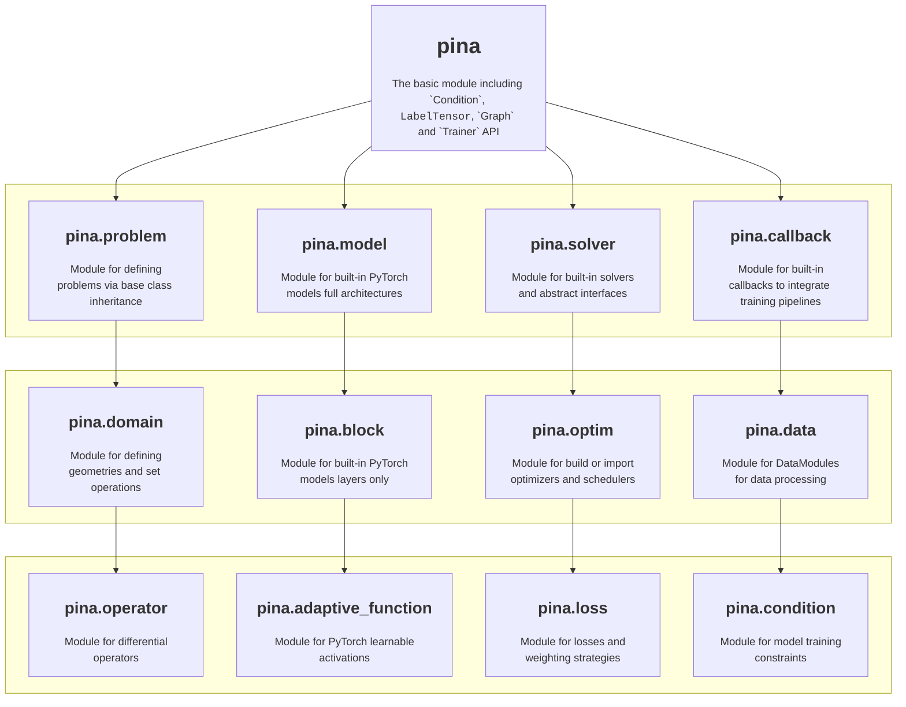

<h2>PINA Code Structure</h2>

Here is a high-level overview of PINA’s main modules. For full details, refer to the
<a href="https://mathlab.github.io/PINA/"><b>documentation</b></a>.
  

```mermaid
flowchart TB
    PINA["<h1>pina</h1>The basic module including `Condition`, <tt>LabelTensor</tt>, `Graph` and `Trainer` API"]

    subgraph R1[" "]
        direction LR
        PROB["<h2>pina.problem</h2> Module for defining problems via base class inheritance"]
        MODEL["<h2>pina.model</h2> Module for built-in PyTorch models full architectures"]
        SOLVER["<h2>pina.solver</h2> Module for built-in solvers and abstract interfaces"]
        CALLBACK["<h2>pina.callback</h2> Module for built-in callbacks to integrate training pipelines"]
    end

    subgraph R2[" "]
        direction LR
        DOMAIN["<h2>pina.domain</h2> Module for defining geometries and set operations"]
        BLOCK["<h2>pina.block</h2> Module for built-in PyTorch models layers only"]
        OPTIM["<h2>pina.optim</h2> Module for build or import optimizers and schedulers"]
        DATA["<h2>pina.data</h2> Module for DataModules for data processing"]
    end

    subgraph R3[" "]
        direction LR
        OPERATOR["<h2>pina.operator</h2> Module for differential operators"]
        ADAPT["<h2>pina.adaptive_function</h2> Module for PyTorch learnable activations"]
        LOSS["<h2>pina.loss</h2> Module for losses and weighting strategies"]
        CONDITION["<h2>pina.condition</h2> Module for model training constraints"]
    end

    PINA --> PROB
    PINA --> MODEL
    PINA --> SOLVER
    PINA --> CALLBACK

    PROB --> DOMAIN
    MODEL --> BLOCK
    SOLVER --> OPTIM
    CALLBACK --> DATA

    DOMAIN --> OPERATOR
    BLOCK --> ADAPT
    OPTIM --> LOSS
    DATA --> CONDITION
```