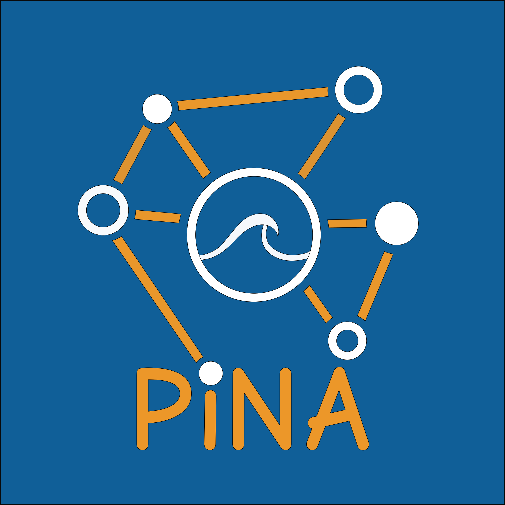
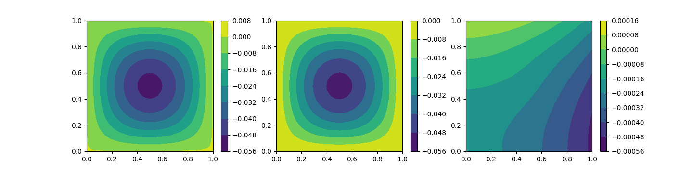

<p align="center">
    <a href="http://mathlab.github.io/PINA/" target="_blank" >
    
    </a>
</p>
<p align="center">
    <a href="https://github.com/mathLab/PINA/blob/master/LICENSE" target="_blank">
        
    </a>
    <a href="https://badge.fury.io/py/pina-mathlab">
	
    </a>
    <a href="https://github.com/mathLab/PINA/actions/workflows/ci.yml" target="_blank">
        
    </a>
    <a href="https://www.codacy.com/gh/mathLab/PINA/dashboard?utm_source=github.com&amp;utm_medium=referral&amp;utm_content=mathLab/PINA&amp;utm_campaign=Badge_Grade">
	
    </a>
    <a href="https://www.codacy.com/gh/mathLab/PINA/dashboard?utm_source=github.com&amp;utm_medium=referral&amp;utm_content=mathLab/PINA&amp;utm_campaign=Badge_Coverage">
	
    </a>
</p>


**PINA**: Physics-Informed Neural networks for Advance modeling

## Table of contents
* [Description](#description)
     * [Problem definition](#problem-definition)
     * [Problem solution](#problem-solution)
* [Dependencies and installation](#dependencies-and-installation)
	* [Installing via PIP](#installing-via-pip)
	* [Installing from source](#installing-from-source)
<!-- * [Documentation](#documentation) -->
<!-- * [Testing](#testing) -->
* [Examples and Tutorials](#examples-and-tutorials)
* [References](#references)
	<!-- * [Recent works with PyDMD](#recent-works-with-pydmd) -->
* [Authors and contributors](#authors-and-contributors)
* [How to contribute](#how-to-contribute)
	* [Submitting a patch](#submitting-a-patch)
* [License](#license)

## Description
**PINA** is a Python package providing an easy interface to deal with *physics-informed neural networks* (PINN) for the approximation of (differential, nonlinear, ...) functions. Based on Pytorch, PINA offers a simple and intuitive way to formalize a specific problem and solve it using PINN.

#### Physics-informed neural network
PINN is a novel approach that involves neural networks to solve supervised learning tasks while respecting any given law of physics described by general nonlinear differential equations. Proposed in *"Physics-informed neural networks: A deep learning framework for solving forward and inverse problems involving nonlinear partial differential equations"*, such framework aims to solve problems in a continuous and nonlinear settings.

#### Problem definition
First step is formalization of the problem in the PINA framework. We take as example here a simple Poisson problem, but PINA is already able to deal with **multi-dimensional**, **parametric**, **time-dependent** problems.
Consider:
$$\begin{cases}\Delta u = \sin(\pi x)\sin(\pi y)\quad& \text{in}\\,D,\\\\u = 0& \text{on}\\,\partial D,\end{cases}$$
where $D = [0, 1]^2$ is a square domain and $u$ the unknown field. The translation in PINA code becomes a new class containing all the information about the domain, about the `conditions` and nothing more:

```python
class Poisson(SpatialProblem):
	spatial_variables = ['x', 'y']
	output_variables = ['u']
	domain = Span({'x': [0, 1], 'y': [0, 1]})

	def laplace_equation(input_, output_):
		force_term = (torch.sin(input_['x']*torch.pi) *
		              torch.sin(input_['y']*torch.pi))
		return nabla(output_['u'], input_).flatten() - force_term

	def nil_dirichlet(input_, output_):
		value = 0.0
		return output_['u'] - value

	conditions = {
		'gamma1': Condition(Span({'x': [-1, 1], 'y':  1}), nil_dirichlet),
		'gamma2': Condition(Span({'x': [-1, 1], 'y': -1}), nil_dirichlet),
		'gamma3': Condition(Span({'x':  1, 'y': [-1, 1]}), nil_dirichlet),
		'gamma4': Condition(Span({'x': -1, 'y': [-1, 1]}), nil_dirichlet),
		'D': Condition(Span({'x': [-1, 1], 'y': [-1, 1]}), laplace_equation),
	}
```

#### Problem solution
After defining it, we want of course to solve such a problem. The only things we need is a `model`, in this case a feed forward network, and some samples of the domain and boundaries, here using a Cartesian grid. In these points we are going to evaluate the residuals, which is nothing but the loss of the network.

```python
poisson_problem = Poisson()

model = FeedForward(layers=[10, 10],
                    output_variables=poisson_problem.output_variables,
                    input_variables=poisson_problem.input_variables)

pinn = PINN(poisson_problem, model, lr=0.003, regularizer=1e-8)
pinn.span_pts(20, 'grid', ['D'])
pinn.span_pts(20, 'grid', ['gamma1', 'gamma2', 'gamma3', 'gamma4'])
pinn.train(1000, 100)

plotter = Plotter()
plotter.plot(pinn)
```
After the training we can infer our model, save it or just plot the PINN approximation. Below the graphical representation of the PINN approximation, the analytical solution of the problem and the absolute error, from left to right.
<p align="center">
  
</p>


## Dependencies and installation
**PINA** requires requires `numpy`, `scipy`, `matplotlib`, `future`, `torch`, `sphinx` (for the documentation) and `pytest` (for local test). The code is tested for Python 3, while compatibility of Python 2 is not guaranteed anymore. It can be installed using `pip` or directly from the source code.

### Installing via PIP
Mac and Linux users can install pre-built binary packages using pip.
To install the package just type:
```bash
> pip install git+https://github.com/mathLab/PINA.git
```
To uninstall the package:
```bash
> pip uninstall pina
```

### Installing from source
The official distribution is on GitHub, and you can clone the repository using
```bash
> git clone https://github.com/mathLab/PINA
```

To install the package just type:
```bash
> pip install -e .
```

<!-- ## Documentation -->
<!-- **PyDMD** uses [Sphinx](http://www.sphinx-doc.org/en/stable/) for code documentation. You can view the documentation online [here](http://mathlab.github.io/PyDMD/). To build the html version of the docs locally simply: -->

<!-- ```bash -->
<!-- > cd docs -->
<!-- > make html -->
<!-- ``` -->

<!-- The generated html can be found in `docs/build/html`. Open up the `index.html` you find there to browse. -->


<!-- ## Testing -->

<!-- We are using Travis CI for continuous intergration testing. You can check out the current status [here](https://travis-ci.org/mathLab/PyDMD). -->

<!-- To run tests locally (`pytest` is required): -->

<!-- ```bash -->
<!-- > pytest -->
<!-- ``` -->

## Examples and Tutorials
The directory `Examples` contains some examples showing Poisson and Burgers problems solved in the PINN context.

### References
To implement the package we follow these works:

* Raissi, Maziar, Paris Perdikaris, and George E. Karniadakis.
  *Physics-informed neural networks: A deep learning framework for solving
  forward and inverse problems involving nonlinear partial differential
  equations.* Journal of Computational Physics 378 (2019): 686-707.


## Authors and contributors
**PINA** is currently developed and mantained at [SISSA mathLab](http://mathlab.sissa.it/) by
* [Nicola Demo](mailto:demo.nicola@gmail.com)
* [Maria Strazzullo](mailto:mstrazzu@gmail.com)


under the supervision of [Prof. Gianluigi Rozza](mailto:gianluigi.rozza@sissa.it).

Contact us by email for further information or questions about **PINA**, or suggest pull requests. Contributions improving either the code or the documentation are welcome!


## How to contribute
We'd love to accept your patches and contributions to this project. There are just a few small guidelines you need to follow.

### Submitting a patch

  1. It's generally best to start by opening a new issue describing the bug or
     feature you're intending to fix.  Even if you think it's relatively minor,
     it's helpful to know what people are working on.  Mention in the initial
     issue that you are planning to work on that bug or feature so that it can
     be assigned to you.

  2. Follow the normal process of [forking][] the project, and setup a new
     branch to work in.  It's important that each group of changes be done in
     separate branches in order to ensure that a pull request only includes the
     commits related to that bug or feature.

  3. To ensure properly formatted code, please make sure to use 4
     spaces to indent the code. The easy way is to run on your bash the provided
     script: ./code_formatter.sh. You should also run [pylint][] over your code.
     It's not strictly necessary that your code be completely "lint-free",
     but this will help you find common style issues.

  4. Any significant changes should almost always be accompanied by tests.  The
     project already has good test coverage, so look at some of the existing
     tests if you're unsure how to go about it. We're using [coveralls][] that
     is an invaluable tools for seeing which parts of your code aren't being
     exercised by your tests.

  5. Do your best to have [well-formed commit messages][] for each change.
     This provides consistency throughout the project, and ensures that commit
     messages are able to be formatted properly by various git tools.

  6. Finally, push the commits to your fork and submit a [pull request][]. Please,
     remember to rebase properly in order to maintain a clean, linear git history.

[forking]: https://help.github.com/articles/fork-a-repo
[pylint]: https://www.pylint.org/
[coveralls]: https://coveralls.io
[well-formed commit messages]: http://tbaggery.com/2008/04/19/a-note-about-git-commit-messages.html
[pull request]: https://help.github.com/articles/creating-a-pull-request


## License

See the [LICENSE](LICENSE.rst) file for license rights and limitations (MIT).
