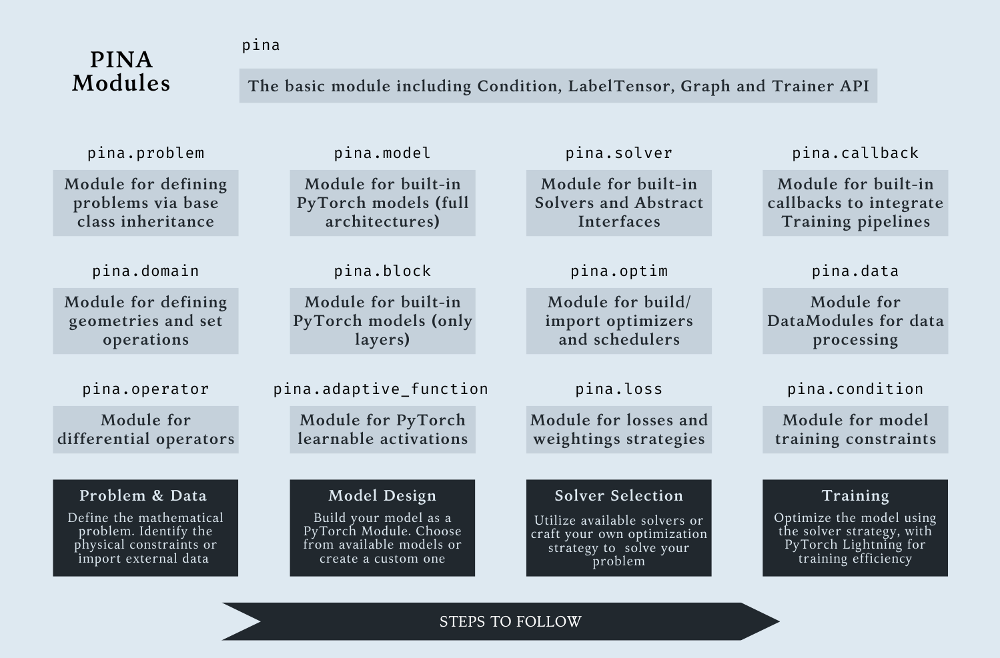

<!--
Copyright Contributors to the Pyro project.

SPDX-License-Identifier: Apache-2.0
-->

<table>
  <tr>
    <td>
      <a href="https://github.com/mathLab/PINA/raw/master/readme/pina_logo.png">
        
      </a>
    </td>
    <td>
      <h2 style="margin-left: 20px; font-size: 1.8rem; line-height: 1.2;">
        Solving Scientific Problems with Machine Learning, Intuitively
      </h2>
    </td>
  </tr>
</table>


-----------------------------------------

[](https://github.com/mathLab/PINA/actions/workflows/pages/pages-build-deployment)
[](https://pypi.org/project/pina-mathlab/)
[](https://pypi.org/project/pina-mathlab/)
[](https://joss.theoj.org/papers/10.21105/joss.05352)
[](https://github.com/mathLab/PINA/blob/main/LICENSE.rst)


[Getting Started](https://github.com/mathLab/PINA/tree/master/tutorials#pina-tutorials) |
[Documentation](https://mathlab.github.io/PINA/) |
[Contributing](https://github.com/mathLab/PINA/blob/master/CONTRIBUTING.md)

**PINA** is an open-source Python library designed to simplify and accelerate the development of Scientific Machine Learning (SciML) solutions. Built on top of [PyTorch](https://pytorch.org/), [PyTorch Lightning](https://lightning.ai/docs/pytorch/stable/), and [PyTorch Geometric](https://pytorch-geometric.readthedocs.io/en/latest/), PINA provides an intuitive framework for defining, experimenting with, and solving complex problems using Neural Networks, Physics-Informed Neural Networks (PINNs), Neural Operators, and more.

- **Modular Architecture**: Designed with modularity in mind and relying on powerful yet composable abstractions, PINA allows users to easily plug, replace, or extend components, making experimentation and customization straightforward.

- **Scalable Performance**: With native support for multi-device training, PINA handles large datasets efficiently, offering performance close to hand-crafted implementations with minimal overhead.

- **Highly Flexible**: Whether you're looking for full automation or granular control, PINA adapts to your workflow. High-level abstractions simplify model definition, while expert users can dive deep to fine-tune every aspect of the training and inference process.


## Installation

### Installing a stable PINA release

**Install using pip:**
```sh
pip install "pina-mathlab"
```

**Install from source:**
```sh
git clone https://github.com/mathLab/PINA
cd PINA
git checkout master
pip install .
```

**Install with extra packages:**

To install extra dependencies required to run tests or tutorials directories, please use the following command:
```sh
pip install "pina-mathlab[extras]" 
```
Available extras include:
* `dev` for development purpuses, use this if you want to [Contribute](https://github.com/mathLab/PINA/blob/master/CONTRIBUTING.md#contributing-to-pina).
* `test` for running test locally.
* `doc` for building documentation locally.
* `tutorial` for running [Tutorials](https://github.com/mathLab/PINA/tree/master/tutorials#pina-tutorials).

## Quick Tour for New Users
Solving a differential problem in **PINA** follows the *four steps pipeline*:

1. Define the problem to be solved with its constraints using the [Problem API](https://mathlab.github.io/PINA/_rst/_code.html#problems).

2. Design your model using PyTorch, or for graph-based problems, leverage PyTorch Geometric to build Graph Neural Networks. You can also import models directly from the [Model API](https://mathlab.github.io/PINA/_rst/_code.html#models).

3. Select or build a Solver for the Problem, e.g., supervised solvers, or physics-informed (e.g., PINN) solvers. [PINA Solvers](https://mathlab.github.io/PINA/_rst/_code.html#solvers) are modular and can be used as-is or customized.

4. Train the model using the [Trainer API](https://mathlab.github.io/PINA/_rst/trainer.html) class, built on PyTorch Lightning, which supports efficient, scalable training with advanced features.

Do you want to learn more about it? Look at our [Tutorials](https://github.com/mathLab/PINA/tree/master/tutorials#pina-tutorials).

### Solve Data Driven Problems
Data driven modelling aims to learn a function that given some input data gives an output (e.g. regression, classification, ...). In PINA you can easily do this by:
```python
import torch
from pina import Trainer
from pina.model import FeedForward
from pina.solver import SupervisedSolver
from pina.problem.zoo import SupervisedProblem

input_tensor  = torch.rand((10, 1))
target_tensor = input_tensor.pow(3)

# Step 1. Define problem
problem = SupervisedProblem(input_tensor, target_tensor)
# Step 2. Design model (you can use your favourite torch.nn.Module in here)
model   = FeedForward(input_dimensions=1, output_dimensions=1, layers=[64, 64])
# Step 3. Define Solver
solver  = SupervisedSolver(problem, model, use_lt=False)
# Step 4. Train
trainer = Trainer(solver, max_epochs=1000, accelerator='gpu')
trainer.train()
```
### Solve Physics Informed Problems
Physics-informed modeling aims to learn functions that not only fit data, but also satisfy known physical laws, such as differential equations or boundary conditions. For example, the following differential problem:

$$
\begin{cases}
\frac{d}{dx}u(x) &=  u(x) \quad x \in(0,1)\\
u(x=0) &= 1
\end{cases}
$$

in PINA, can be easily implemented by:

```python
from pina import Trainer, Condition
from pina.problem import SpatialProblem
from pina.operator import grad
from pina.solver import PINN
from pina.model import FeedForward
from pina.domain import CartesianDomain
from pina.equation import Equation, FixedValue

def ode_equation(input_, output_):
    u_x = grad(output_, input_, components=["u"], d=["x"])
    u = output_.extract(["u"])
    return u_x - u

# build the problem
class SimpleODE(SpatialProblem):
    output_variables = ["u"]
    spatial_domain = CartesianDomain({"x": [0, 1]})
    domains = {
        "x0": CartesianDomain({"x": 0.0}),
        "D": CartesianDomain({"x": [0, 1]}),
    }
    conditions = {
        "bound_cond": Condition(domain="x0", equation=FixedValue(1.0)),
        "phys_cond": Condition(domain="D", equation=Equation(ode_equation)),
    }

# Step 1. Define problem
problem = SimpleODE()
problem.discretise_domain(n=100, mode="grid", domains=["D", "x0"])
# Step 2. Design model (you can use your favourite torch.nn.Module in here)
model   = FeedForward(input_dimensions=1, output_dimensions=1, layers=[64, 64])
# Step 3. Define Solver
solver  = PINN(problem, model)
# Step 4. Train
trainer = Trainer(solver, max_epochs=1000, accelerator='gpu')
trainer.train()
```

## Application Programming Interface
Here's a quick look at PINA's main module. For a better experience and full details, check out the [documentation](https://mathlab.github.io/PINA/).

<a href="https://github.com/mathLab/PINA/readme/PINA_API.png">
  
</a>

## Contributing and Community

We would love to develop PINA together with our community! Best way to get started is to select any issue from the [`good-first-issue` label](https://github.com/mathLab/PINA/issues?q=is%3Aopen+is%3Aissue+label%3A%22good+first+issue%22). If you would like to contribute, please review our [Contributing Guide](CONTRIBUTING.md) for all relevant details.

We warmly thank all the contributors that have supported PINA so far:

<a href="https://github.com/mathLab/PINA/graphs/contributors">
  
</a>

Made with [contrib.rocks](https://contrib.rocks).

## Citation
If **PINA** has been significant in your research, and you would like to acknowledge the project in your academic publication, we suggest citing the following paper:

```
Coscia, D., Ivagnes, A., Demo, N., & Rozza, G. (2023). Physics-Informed Neural networks for Advanced modeling. Journal of Open Source Software, 8(87), 5352.
```

Or in BibTex format
```
@article{coscia2023physics,
        title={Physics-Informed Neural networks for Advanced modeling},
        author={Coscia, Dario and Ivagnes, Anna and Demo, Nicola and Rozza, Gianluigi},
        journal={Journal of Open Source Software},
        volume={8},
        number={87},
        pages={5352},
        year={2023}
        }
```
