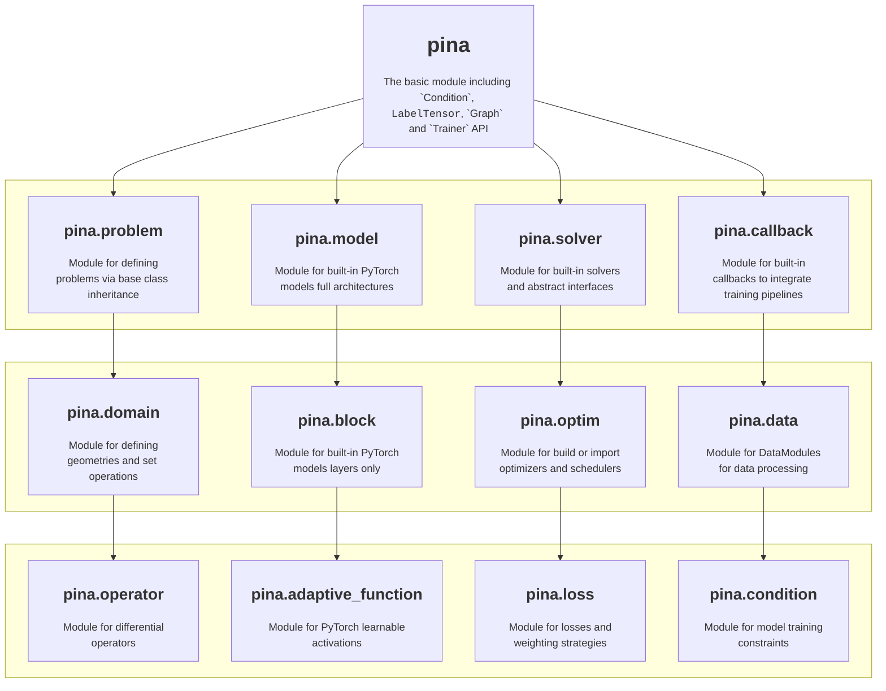
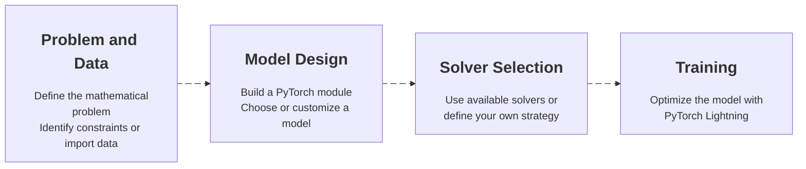

<!--
Copyright Contributors to the Pyro project.

SPDX-License-Identifier: Apache-2.0
-->

  

  
  
  
  
  
  
  

  

  <h1 style="margin-top: 15px; margin-bottom: 0;">
    PINA
  </h1>
  

    <b>A Unified Framework for Scientific Machine Learning</b>
  

  

           
  

    <b>PINA</b> is an open-source Python library designed to simplify and accelerate the development of
    <b>Scientific Machine Learning</b> (SciML) solutions, including <b>PINNs</b>, Neural Operators,
    data-driven modeling, and more.
  

  

  <h4 style="margin-top: 15px; margin-bottom: 0;">  Built on top of </h4>

    
  
  
  
  

  

  <h4 style="margin-top: 15px; margin-bottom: 0;">  ────────────── &nbsp; &nbsp; For New User &nbsp; &nbsp; ────────────── </h4>
  
  
  

  

  <h4 style="margin-top: 15px; margin-bottom: 0;">  ────────────── &nbsp; &nbsp; For New User &nbsp; &nbsp; ────────────── </h4>
  
  
  
  
  

  

  Built on top of
  
  
  
  

<h2>🗞️ News & Announcements</h2>

  <ul style="margin: 0; padding-left: 18px; line-height: 1.55;">
    <li>
      <b>[YYYY-MM-DD]</b> – Short announcement headline.
      <a href="LINK">More</a>
    </li>
    <li>
      <b>[YYYY-MM-DD]</b> – Another update: new release / tutorial / paper / feature.
      <a href="LINK">Details</a>
    </li>
    <li>
      <b>[YYYY-MM-DD]</b> – Maintenance note / deprecation / API change.
      <a href="LINK">Read</a>
    </li>
  </ul>

  <i>Want the full history?</i>
  See the <a href="https://github.com/mathLab/PINA/releases"><b>Releases</b></a> page and the
  <a href="https://github.com/mathLab/PINA/blob/master/CHANGELOG.md"><b>Changelog</b></a> (if present).

<h2>✨ Key Features</h2>

<ul>
  <li>
    <b>Modular Architecture</b>:
    plug, replace, and extend components easily with composable abstractions.
  </li>
  <li>
    <b>Scalable Performance</b>:
    native multi-device support for efficient large-scale training.
  </li>
  <li>
    <b>Highly Flexible</b>:
    use high-level APIs for speed or dive into full customization when needed.
  </li>
</ul>

<h2>📦 Installation</h2>

<h3>Install a stable release</h3>

<pre><code>pip install "pina-mathlab"</code></pre>

<h3>Install from source</h3>

<pre><code>git clone https://github.com/mathLab/PINA
cd PINA
git checkout master
pip install .
</code></pre>

<h3>Install with extra dependencies</h3>

To install additional packages required for development, tests, docs, or tutorials:

<pre><code>pip install "pina-mathlab[extras]"</code></pre>

Available extras:

<ul>
  <li><code>dev</code> for development purposes</li>
  <li><code>test</code> for running tests locally</li>
  <li><code>doc</code> for building documentation locally</li>
  <li><code>tutorial</code> for running tutorials</li>
</ul>

<h2>🚀 Quick Tour</h2>

Solving a differential problem in <b>PINA</b> follows a clean four-step pipeline:

<ol>
  <li>
    Define the problem and constraints using the
    <a href="https://mathlab.github.io/PINA/_rst/_code.html#problems"><b>Problem API</b></a>.
  </li>
  <li>
    Design your model using PyTorch, PyTorch Geometric, or import from the
    <a href="https://mathlab.github.io/PINA/_rst/_code.html#models"><b>Model API</b></a>.
  </li>
  <li>
    Select or build a Solver using the
    <a href="https://mathlab.github.io/PINA/_rst/_code.html#solvers"><b>Solver API</b></a>.
  </li>
  <li>
    Train with the
    <a href="https://mathlab.github.io/PINA/_rst/trainer.html"><b>Trainer API</b></a>,
    powered by PyTorch Lightning.
  </li>
</ol>

Want to dive deeper? Check out the official
<a href="https://github.com/mathLab/PINA/tree/master/tutorials#pina-tutorials"><b>Tutorials</b></a>.

<h2>🧠 Data-Driven Modeling Example</h2>

<pre><code class="language-python">import torch
from pina import Trainer
from pina.model import FeedForward
from pina.solver import SupervisedSolver
from pina.problem.zoo import SupervisedProblem

input_tensor  = torch.rand((10, 1))
target_tensor = input_tensor.pow(3)

# Step 1. Define problem
problem = SupervisedProblem(input_tensor, target_tensor)

# Step 2. Define model
model = FeedForward(input_dimensions=1, output_dimensions=1, layers=[64, 64])

# Step 3. Define solver
solver = SupervisedSolver(problem, model, use_lt=False)

# Step 4. Train
trainer = Trainer(solver, max_epochs=1000, accelerator="gpu")
trainer.train()
</code></pre>

<h2>🧩 Physics-Informed Example</h2>

Consider the following differential problem:

  

In PINA, this can be implemented as:

<pre><code class="language-python">from pina import Trainer, Condition
from pina.problem import SpatialProblem
from pina.operator import grad
from pina.solver import PINN
from pina.model import FeedForward
from pina.domain import CartesianDomain
from pina.equation import Equation, FixedValue

def ode_equation(input_, output_):
    u_x = grad(output_, input_, components=["u"], d=["x"])
    u = output_.extract(["u"])
    return u_x - u

class SimpleODE(SpatialProblem):
    output_variables = ["u"]
    spatial_domain = CartesianDomain({"x": [0, 1]})
    domains = {
        "x0": CartesianDomain({"x": 0.0}),
        "D": CartesianDomain({"x": [0, 1]}),
    }
    conditions = {
        "bound_cond": Condition(domain="x0", equation=FixedValue(1.0)),
        "phys_cond": Condition(domain="D", equation=Equation(ode_equation)),
    }

# Step 1. Define problem
problem = SimpleODE()
problem.discretise_domain(n=100, mode="grid", domains=["D", "x0"])

# Step 2. Define model
model = FeedForward(input_dimensions=1, output_dimensions=1, layers=[64, 64])

# Step 3. Define solver
solver = PINN(problem, model)

# Step 4. Train
trainer = Trainer(solver, max_epochs=1000, accelerator="gpu")
trainer.train()
</code></pre>

<h2>📚 API Overview</h2>

Here is a high-level overview of PINA’s main modules. For full details, refer to the
<a href="https://mathlab.github.io/PINA/"><b>documentation</b></a>.

## PINA Modules Structure
Here's a quick look at PINA's main module. For a better experience and full details, check out the [documentation](https://mathlab.github.io/PINA/).

```mermaid
flowchart TB
    PINA["<h1>pina</h1>The basic module including `Condition`, <tt>LabelTensor</tt>, `Graph` and `Trainer` API"]

    subgraph R1[" "]
        direction LR
        PROB["<h2>pina.problem</h2> Module for defining problems via base class inheritance"]
        MODEL["<h2>pina.model</h2> Module for built-in PyTorch models full architectures"]
        SOLVER["<h2>pina.solver</h2> Module for built-in solvers and abstract interfaces"]
        CALLBACK["<h2>pina.callback</h2> Module for built-in callbacks to integrate training pipelines"]
    end

    subgraph R2[" "]
        direction LR
        DOMAIN["<h2>pina.domain</h2> Module for defining geometries and set operations"]
        BLOCK["<h2>pina.block</h2> Module for built-in PyTorch models layers only"]
        OPTIM["<h2>pina.optim</h2> Module for build or import optimizers and schedulers"]
        DATA["<h2>pina.data</h2> Module for DataModules for data processing"]
    end

    subgraph R3[" "]
        direction LR
        OPERATOR["<h2>pina.operator</h2> Module for differential operators"]
        ADAPT["<h2>pina.adaptive_function</h2> Module for PyTorch learnable activations"]
        LOSS["<h2>pina.loss</h2> Module for losses and weighting strategies"]
        CONDITION["<h2>pina.condition</h2> Module for model training constraints"]
    end

    PINA --> PROB
    PINA --> MODEL
    PINA --> SOLVER
    PINA --> CALLBACK

    PROB --> DOMAIN
    MODEL --> BLOCK
    SOLVER --> OPTIM
    CALLBACK --> DATA

    DOMAIN --> OPERATOR
    BLOCK --> ADAPT
    OPTIM --> LOSS
    DATA --> CONDITION

```
### Steps to Follow

```mermaid
flowchart LR
    STEP1["<h2>Problem and Data</h2> Define the mathematical problem<br>Identify constraints or import data"]
    STEP2["<h2>Model Design</h2> Build a PyTorch module Choose or customize a model"]
    STEP3["<h2>Solver Selection</h2> Use available solvers or define your own strategy"]
    STEP4["<h2>Training</h2> Optimize the model with PyTorch Lightning"]

    STEP1 e1@--> STEP2
    STEP2 e2@--> STEP3
    STEP3 e3@--> STEP4
    e1@{ animate: true }
    e2@{ animate: true }
    e3@{ animate: true }
```

<h2>🤝 Contributing & Community</h2>

We would love to develop PINA together with the community.
A great place to start is the list of
<a href="https://github.com/mathLab/PINA/issues?q=is%3Aopen+is%3Aissue+label%3A%22good+first+issue%22">
  <b>good-first-issue</b>
</a>
issues.

If you would like to contribute, please read the
<a href="CONTRIBUTING.md"><b>Contributing Guide</b></a>.

  

  Made with <a href="https://contrib.rocks/">contrib.rocks</a>.

<h2>📌 Citation</h2>

If <b>PINA</b> has been significant in your research and you would like to acknowledge it, please cite:

<pre><code>Coscia, D., Ivagnes, A., Demo, N., & Rozza, G. (2023).
Physics-Informed Neural networks for Advanced modeling.
Journal of Open Source Software, 8(87), 5352.</code></pre>

Or in BibTeX format:

<pre><code>@article{coscia2023physics,
  title={Physics-Informed Neural networks for Advanced modeling},
  author={Coscia, Dario and Ivagnes, Anna and Demo, Nicola and Rozza, Gianluigi},
  journal={Journal of Open Source Software},
  volume={8},
  number={87},
  pages={5352},
  year={2023}
}</code></pre>
