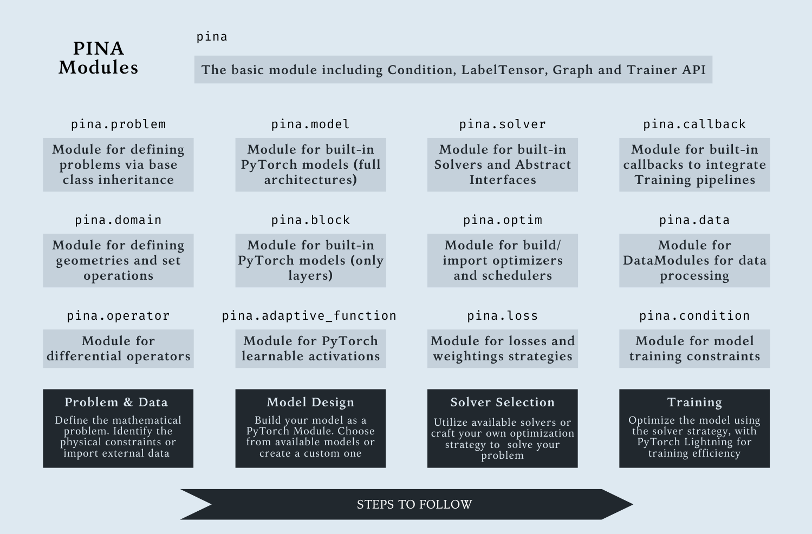

Code Documentation
==================
Welcome to PINA documentation! Here you can find the modules of the package divided in different sections.
The high-level structure of the package is depicted in our API.

The pipeline to solve differential equations with PINA follows just five steps:

    1. Define the `Problems`_ the user aim to solve
    2. Generate data using built in `Geometrical Domains`_, or load high level simulation results as :doc:`LabelTensor <label_tensor>`
    3. Choose or build one or more `Models`_ to solve the problem
    4. Choose a solver across PINA available `Solvers`_, or build one using the :doc:`SolverInterface <solver/solver_interface>`
    5. Train the model with the PINA :doc:`Trainer <solver/solver_interface>`, enhance the train with `Callbacks`_

Trainer, Dataset and Datamodule
--------------------------------
.. toctree::
    :titlesonly:

    Trainer <trainer.rst>
    Dataset <data/dataset.rst>
    DataModule <data/data_module.rst>
    Dataloader <data/dataloader.rst>

Data Types
------------
.. toctree::
    :titlesonly:

    LabelTensor <label_tensor.rst>
    Graph <graph/graph.rst>
    LabelBatch <graph/label_batch.rst>

Graphs Structures
------------------
.. toctree::
    :titlesonly:

    GraphBuilder <graph/graph_builder.rst>
    RadiusGraph <graph/radius_graph.rst>
    KNNGraph <graph/knn_graph.rst>

Conditions
-------------
.. toctree::
    :titlesonly:

    ConditionInterface <condition/condition_interface.rst>
    Condition <condition/condition.rst>
    DataCondition <condition/data_condition.rst>
    DomainEquationCondition <condition/domain_equation_condition.rst>
    InputEquationCondition <condition/input_equation_condition.rst>
    InputTargetCondition <condition/input_target_condition.rst>

Solvers
--------------

.. toctree::
    :titlesonly:

    SolverInterface <solver/solver_interface.rst>
    SingleSolverInterface <solver/single_solver_interface.rst>
    MultiSolverInterface <solver/multi_solver_interface.rst>
    SupervisedSolverInterface <solver/supervised_solver/supervised_solver_interface>
    DeepEnsembleSolverInterface <solver/ensemble_solver/ensemble_solver_interface>
    PINNInterface <solver/physics_informed_solver/pinn_interface.rst>
    PINN <solver/physics_informed_solver/pinn.rst>
    GradientPINN <solver/physics_informed_solver/gradient_pinn.rst>
    CausalPINN <solver/physics_informed_solver/causal_pinn.rst>
    CompetitivePINN <solver/physics_informed_solver/competitive_pinn.rst>
    SelfAdaptivePINN <solver/physics_informed_solver/self_adaptive_pinn.rst>
    RBAPINN <solver/physics_informed_solver/rba_pinn.rst>
    DeepEnsemblePINN <solver/ensemble_solver/ensemble_pinn>
    SupervisedSolver <solver/supervised_solver/supervised.rst>
    DeepEnsembleSupervisedSolver <solver/ensemble_solver/ensemble_supervised>
    ReducedOrderModelSolver <solver/supervised_solver/reduced_order_model.rst>
    GAROM <solver/garom.rst>

Models
------------

.. toctree::
    :titlesonly:
    :maxdepth: 5

    FeedForward <model/feed_forward.rst>
    MultiFeedForward <model/multi_feed_forward.rst>
    ResidualFeedForward <model/residual_feed_forward.rst>
    Spline <model/spline.rst>
    SplineSurface <model/spline_surface.rst>
    DeepONet <model/deeponet.rst>
    MIONet <model/mionet.rst>
    KernelNeuralOperator <model/kernel_neural_operator.rst>
    FourierIntegralKernel <model/fourier_integral_kernel.rst>
    FNO <model/fourier_neural_operator.rst>
    AveragingNeuralOperator <model/average_neural_operator.rst>
    LowRankNeuralOperator <model/low_rank_neural_operator.rst>
    GraphNeuralOperator <model/graph_neural_operator.rst>
    GraphNeuralKernel <model/graph_neural_operator_integral_kernel.rst>
    PirateNet <model/pirate_network.rst>
    EquivariantGraphNeuralOperator <model/equivariant_graph_neural_operator.rst>
    SINDy <model/sindy.rst>

Blocks
-------------

.. toctree::
    :titlesonly:

    Residual Block <model/block/residual.rst>
    EnhancedLinear Block <model/block/enhanced_linear.rst>
    Spectral Convolution Block <model/block/spectral.rst>
    Fourier Block <model/block/fourier_block.rst>
    Averaging Block <model/block/average_neural_operator_block.rst>
    Low Rank Block <model/block/low_rank_block.rst>
    Graph Neural Operator Block <model/block/gno_block.rst>
    Continuous Convolution Interface <model/block/convolution_interface.rst>
    Continuous Convolution Block <model/block/convolution.rst>
    Orthogonal Block <model/block/orthogonal.rst>
    PirateNet Block <model/block/pirate_network_block.rst>

Message Passing
-------------------

.. toctree::
    :titlesonly:

    Deep Tensor Network Block <model/block/message_passing/deep_tensor_network_block.rst>
    E(n) Equivariant Network Block <model/block/message_passing/en_equivariant_network_block.rst>
    Interaction Network Block <model/block/message_passing/interaction_network_block.rst>
    Radial Field Network Block <model/block/message_passing/radial_field_network_block.rst>
    EquivariantGraphNeuralOperatorBlock <model/block/message_passing/equivariant_graph_neural_operator_block.rst>

Reduction and Embeddings
--------------------------

.. toctree::
    :titlesonly:

    Proper Orthogonal Decomposition <model/block/pod_block.rst>
    Periodic Boundary Condition Embedding <model/block/pbc_embedding.rst>
    Fourier Feature Embedding <model/block/fourier_embedding.rst>
    Radial Basis Function Interpolation <model/block/rbf_block.rst>

Optimizers and Schedulers
--------------------------

.. toctree::
    :titlesonly:

    Optimizer <optim/optimizer_interface.rst>
    Scheduler <optim/scheduler_interface.rst>
    TorchOptimizer <optim/torch_optimizer.rst>
    TorchScheduler <optim/torch_scheduler.rst>
    

Adaptive Activation Functions
-------------------------------

.. toctree::
    :titlesonly:

    Adaptive Function Interface <adaptive_function/AdaptiveActivationFunctionInterface.rst>
    Adaptive ReLU <adaptive_function/AdaptiveReLU.rst>
    Adaptive Sigmoid <adaptive_function/AdaptiveSigmoid.rst>
    Adaptive Tanh <adaptive_function/AdaptiveTanh.rst>
    Adaptive SiLU <adaptive_function/AdaptiveSiLU.rst>
    Adaptive Mish <adaptive_function/AdaptiveMish.rst>
    Adaptive ELU <adaptive_function/AdaptiveELU.rst>
    Adaptive CELU <adaptive_function/AdaptiveCELU.rst>
    Adaptive GELU <adaptive_function/AdaptiveGELU.rst>
    Adaptive Softmin <adaptive_function/AdaptiveSoftmin.rst>
    Adaptive Softmax <adaptive_function/AdaptiveSoftmax.rst>
    Adaptive SIREN <adaptive_function/AdaptiveSIREN.rst>
    Adaptive Exp <adaptive_function/AdaptiveExp.rst>

Equations and Differential Operators
---------------------------------------

.. toctree::
    :titlesonly:

    EquationInterface <equation/equation_interface.rst>
    Equation <equation/equation.rst>
    SystemEquation <equation/system_equation.rst>
    Equation Factory <equation/equation_factory.rst>
    Differential Operators <operator.rst>

Problems
--------------

.. toctree::
    :titlesonly:

    AbstractProblem <problem/abstract_problem.rst>
    InverseProblem <problem/inverse_problem.rst>
    ParametricProblem <problem/parametric_problem.rst>
    SpatialProblem <problem/spatial_problem.rst>
    TimeDependentProblem <problem/time_dependent_problem.rst>

Problems Zoo
--------------

.. toctree::
    :titlesonly:

    AcousticWaveProblem <problem/zoo/acoustic_wave.rst>
    AdvectionProblem <problem/zoo/advection.rst>
    AllenCahnProblem <problem/zoo/allen_cahn.rst>
    DiffusionReactionProblem <problem/zoo/diffusion_reaction.rst>
    HelmholtzProblem <problem/zoo/helmholtz.rst>
    InversePoisson2DSquareProblem <problem/zoo/inverse_poisson_2d_square.rst>
    Poisson2DSquareProblem <problem/zoo/poisson_2d_square.rst>
    SupervisedProblem <problem/zoo/supervised_problem.rst>

Geometrical Domains
--------------------

.. toctree::
    :titlesonly:

    Domain <domain/domain.rst>
    CartesianDomain <domain/cartesian.rst>
    EllipsoidDomain <domain/ellipsoid.rst>
    SimplexDomain <domain/simplex.rst>

Domain Operations
------------------

.. toctree::
    :titlesonly:

    OperationInterface <domain/operation_interface.rst>
    Union <domain/union_domain.rst>
    Intersection <domain/intersection_domain.rst>
    Difference <domain/difference_domain.rst>
    Exclusion <domain/exclusion_domain.rst>

Callbacks
-----------

.. toctree::
    :titlesonly:

    Processing callback <callback/processing_callback.rst>
    Optimizer callback <callback/optimizer_callback.rst>
    Switch Scheduler <callback/switch_scheduler.rst>
    R3 Refinment callback <callback/refinement/r3_refinement.rst>
    Refinment Interface callback <callback/refinement/refinement_interface.rst>
    Normalizer callback <callback/normalizer_data_callback.rst>

Losses and Weightings
---------------------

.. toctree::
    :titlesonly:

    LossInterface <loss/loss_interface.rst>
    LpLoss <loss/lploss.rst>
    PowerLoss <loss/powerloss.rst>
    WeightingInterface <loss/weighting_interface.rst>
    ScalarWeighting <loss/scalar_weighting.rst>
    NeuralTangentKernelWeighting <loss/ntk_weighting.rst>
    SelfAdaptiveWeighting <loss/self_adaptive_weighting.rst>
    LinearWeighting <loss/linear_weighting.rst>