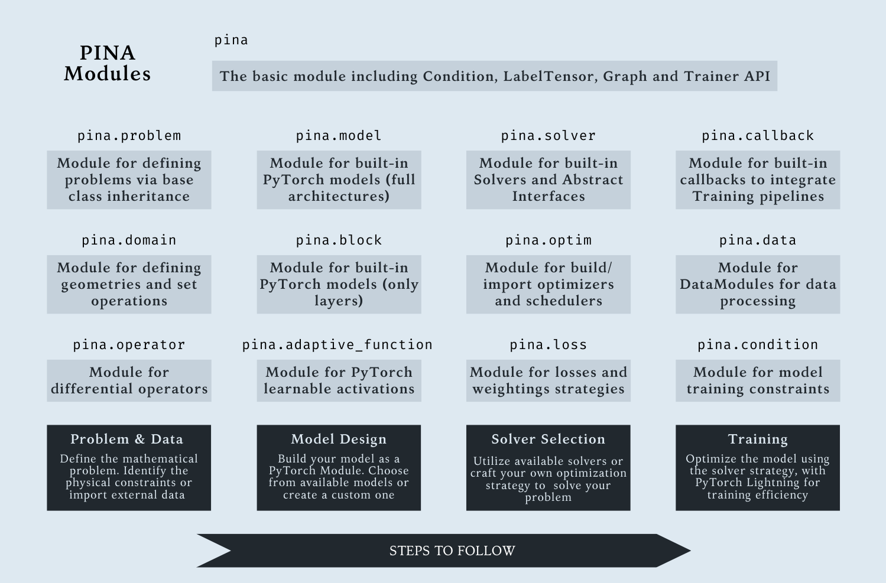

.. docmeta::
   :status: complete
   :needs_example: false
   :needs_advanced_example: false
   :reviewer:
   :last_reviewed: 2026-06-24

Code Documentation
==================
Welcome to PINA documentation! Here you can find the modules of the package divided in different sections.
The high-level structure of the package is depicted in our API.

The pipeline to solve differential equations with PINA follows just five steps:

    1. Define the `Problems`_ the user aim to solve
    2. Generate data using built in `Geometrical Domains`_, or load high level simulation results as :doc:`LabelTensor <label_tensor>`
    3. Choose or build one or more `Models`_ to solve the problem
    4. Choose a solver across PINA available `Solvers`_, or build one using the :doc:`SolverInterface <solver/solver_interface>`
    5. Train the model with the PINA :doc:`Trainer <trainer>`, enhance the train with `Callbacks`_

Trainer, Data Loader and Data Module
----------------------------------------
.. toctree::
    :titlesonly:

    Trainer <trainer.rst>
    Data Module <data/data_module.rst>
    Single-Batch Data Loader <data/single_batch_data_loader.rst>
    Aggregator <data/aggregator.rst>
    Creator <data/creator.rst>
    Condition Subset <data/condition_subset.rst>

Data Types
------------
.. toctree::
    :titlesonly:

    LabelTensor <label_tensor.rst>
    Graph <graph/graph.rst>
    LabelBatch <graph/label_batch.rst>

Graphs Structures
------------------
.. toctree::
    :titlesonly:

    GraphBuilder <graph/graph_builder.rst>
    RadiusGraph <graph/radius_graph.rst>
    KNNGraph <graph/knn_graph.rst>

Conditions
-------------
.. toctree::
    :titlesonly:

    Condition Interface <condition/condition_interface.rst>
    Base Condition <condition/base_condition.rst>
    Condition <condition/condition.rst>
    Data Condition <condition/data_condition.rst>
    Domain Equation Condition <condition/domain_equation_condition.rst>
    Graph Time Series Condition <condition/graph_time_series_condition.rst>
    Input Equation Condition <condition/input_equation_condition.rst>
    Input Target Condition <condition/input_target_condition.rst>
    Time Series Condition <condition/time_series_condition.rst>

Batch and Data Managers
--------------------------
.. toctree::
    :titlesonly:

    Batch Manager <data/manager/batch_manager.rst>
    Data Manager Interface <data/manager/data_manager_interface.rst>
    Data Manager <data/manager/data_manager.rst>
    Graph Data Manager <data/manager/graph_data_manager.rst>
    Tensor Data Manager <data/manager/tensor_data_manager.rst>

Solvers
------------------------

.. toctree::
    :titlesonly:

    Solver Interface <solver/solver_interface.rst>
    Base Solver <solver/base_solver.rst>
    Single-Model Solver <solver/single_model_solver.rst>
    Multi-Model Solver <solver/multi_model_solver.rst>
    Ensemble Solver <solver/ensemble_solver.rst>
    Supervised Single-Model Solver <solver/supervised_single_model_solver.rst>
    Supervised Ensemble Solver <solver/supervised_ensemble_solver.rst>
    Physics-Informed Single-Model Solver <solver/physics_informed_single_model_solver.rst>
    Physics-Informed Ensemble Solver <solver/physics_informed_ensemble_solver.rst>
    Autoregressive Single-Model Solver <solver/autoregressive_single_model_solver.rst>
    Autoregressive Ensemble Solver <solver/autoregressive_ensemble_solver.rst>
    Self-Adaptive Physics-Informed Solver <solver/self_adaptive_physics_informed_solver.rst>
    Competitive Physics-Informed Solver <solver/competitive_physics_informed_solver.rst>
    Gradient Physics-Informed Single-Model Solver <solver/gradient_physics_informed_single_model_solver.rst>
    RBA Physics-Informed Single-Model Solver <solver/rba_physics_informed_single_model_solver.rst>
    Causal Physics-Informed Single-Model Solver <solver/causal_physics_informed_single_model_solver.rst>

Mixins
------------------------

.. toctree::
    :titlesonly:

    Single-Model Mixin <solver/mixin/single_model_mixin.rst>
    Multi-Model Mixin <solver/mixin/multi_model_mixin.rst>
    Ensemble Mixin <solver/mixin/ensemble_mixin.rst>
    Condition Aggregator Mixin <solver/mixin/condition_aggregator_mixin.rst>
    Manual Optimization Mixin <solver/mixin/manual_optimization_mixin.rst>
    Physics-Informed Mixin <solver/mixin/physics_informed_mixin.rst>
    Autoregressive Mixin <solver/mixin/autoregressive_mixin.rst>
    Gradient-Enhanced Mixin <solver/mixin/gradient_enhanced_mixin.rst>
    Residual-Based Attention Mixin <solver/mixin/residual_based_attention_mixin.rst>

Models
------------

.. toctree::
    :titlesonly:
    :maxdepth: 5

    FeedForward <model/feed_forward.rst>
    MultiFeedForward <model/multi_feed_forward.rst>
    ResidualFeedForward <model/residual_feed_forward.rst>
    Spline <model/spline.rst>
    SplineSurface <model/spline_surface.rst>
    DeepONet <model/deeponet.rst>
    MIONet <model/mionet.rst>
    KernelNeuralOperator <model/kernel_neural_operator.rst>
    FourierIntegralKernel <model/fourier_integral_kernel.rst>
    FNO <model/fourier_neural_operator.rst>
    AveragingNeuralOperator <model/average_neural_operator.rst>
    LowRankNeuralOperator <model/low_rank_neural_operator.rst>
    GraphNeuralOperator <model/graph_neural_operator.rst>
    GraphNeuralKernel <model/graph_neural_operator_integral_kernel.rst>
    PirateNet <model/pirate_network.rst>
    EquivariantGraphNeuralOperator <model/equivariant_graph_neural_operator.rst>
    SINDy <model/sindy.rst>
    Vectorized Spline <model/vectorized_spline.rst>
    Kolmogorov-Arnold Network <model/kolmogorov_arnold_network.rst>

Blocks
-------------

.. toctree::
    :titlesonly:

    Residual Block <model/block/residual.rst>
    EnhancedLinear Block <model/block/enhanced_linear.rst>
    Spectral Convolution Block <model/block/spectral.rst>
    Fourier Block <model/block/fourier_block.rst>
    Averaging Block <model/block/average_neural_operator_block.rst>
    Low Rank Block <model/block/low_rank_block.rst>
    Graph Neural Operator Block <model/block/gno_block.rst>
    Continuous Convolution Interface <model/block/convolution_interface.rst>
    Continuous Convolution Block <model/block/convolution.rst>
    Orthogonal Block <model/block/orthogonal.rst>
    PirateNet Block <model/block/pirate_network_block.rst>
    KAN Block <model/block/kan_block.rst>

Message Passing
-------------------

.. toctree::
    :titlesonly:

    Deep Tensor Network Block <model/block/message_passing/deep_tensor_network_block.rst>
    E(n) Equivariant Network Block <model/block/message_passing/en_equivariant_network_block.rst>
    Interaction Network Block <model/block/message_passing/interaction_network_block.rst>
    Radial Field Network Block <model/block/message_passing/radial_field_network_block.rst>
    EquivariantGraphNeuralOperatorBlock <model/block/message_passing/equivariant_graph_neural_operator_block.rst>

Reduction and Embeddings
--------------------------

.. toctree::
    :titlesonly:

    Proper Orthogonal Decomposition <model/block/pod_block.rst>
    Periodic Boundary Condition Embedding <model/block/pbc_embedding.rst>
    Fourier Feature Embedding <model/block/fourier_embedding.rst>
    Radial Basis Function Interpolation <model/block/rbf_block.rst>

Optimizers and Schedulers
--------------------------

.. toctree::
    :titlesonly:

    Optimizer Interface <optim/optimizer_interface.rst>
    Scheduler Interface <optim/scheduler_interface.rst>
    Torch Optimizer <optim/torch_optimizer.rst>
    Torch Scheduler <optim/torch_scheduler.rst>
    

Adaptive Functions
-------------------------------

.. toctree::
    :titlesonly:

    Adaptive Function Interface <adaptive_function/adaptive_function_interface.rst>
    Base Adaptive Function <adaptive_function/base_adaptive_function.rst>
    Adaptive CELU <adaptive_function/adaptive_celu.rst>
    Adaptive ELU <adaptive_function/adaptive_elu.rst>
    Adaptive Exp <adaptive_function/adaptive_exp.rst>
    Adaptive GELU <adaptive_function/adaptive_gelu.rst>
    Adaptive Mish <adaptive_function/adaptive_mish.rst>
    Adaptive ReLU <adaptive_function/adaptive_relu.rst>
    Adaptive Sigmoid <adaptive_function/adaptive_sigmoid.rst>
    Adaptive SiLU <adaptive_function/adaptive_silu.rst>
    Adaptive SIREN <adaptive_function/adaptive_siren.rst>
    Adaptive Softmax <adaptive_function/adaptive_softmax.rst>
    Adaptive Softmin <adaptive_function/adaptive_softmin.rst>
    Adaptive Tanh <adaptive_function/adaptive_tanh.rst>

Equations and Differential Operators
---------------------------------------

.. toctree::
    :titlesonly:

    Equation Interface <equation/equation_interface.rst>
    Base Equation <equation/base_equation.rst>
    Equation <equation/equation.rst>
    System Equation <equation/system_equation.rst>
    Differential Operators <operator.rst>

Equation Zoo
---------------------------------------

.. toctree::
    :titlesonly:

    Acoustic Wave Equation <equation/zoo/acoustic_wave_equation.rst>
    Advection Equation <equation/zoo/advection_equation.rst>
    Allen-Cahn Equation <equation/zoo/allen_cahn_equation.rst>
    Burgers' Equation <equation/zoo/burgers_equation.rst>
    Diffusion-Reaction Equation <equation/zoo/diffusion_reaction_equation.rst>
    Fixed Flux <equation/zoo/fixed_flux.rst>
    Fixed Gradient <equation/zoo/fixed_gradient.rst>
    Fixed Laplacian <equation/zoo/fixed_laplacian.rst>
    Fixed Value <equation/zoo/fixed_value.rst>
    Helmholtz Equation <equation/zoo/helmholtz_equation.rst>
    Poisson Equation <equation/zoo/poisson_equation.rst>

Problems
--------------

.. toctree::
    :titlesonly:

    ProblemInterface <problem/problem_interface.rst>
    BaseProblem <problem/base_problem.rst>
    InverseProblem <problem/inverse_problem.rst>
    ParametricProblem <problem/parametric_problem.rst>
    SpatialProblem <problem/spatial_problem.rst>
    TimeDependentProblem <problem/time_dependent_problem.rst>

Problem Zoo
--------------

.. toctree::
    :titlesonly:

    Acoustic Wave Problem <problem/zoo/acoustic_wave_problem.rst>
    Advection Problem <problem/zoo/advection_problem.rst>
    Allen-Cahn Problem <problem/zoo/allen_cahn_problem.rst>
    Burgers' Problem <problem/zoo/burgers_problem.rst>
    Diffusion-Reaction Problem <problem/zoo/diffusion_reaction_problem.rst>
    Helmholtz Problem <problem/zoo/helmholtz_problem.rst>
    Inverse Poisson 2D Square Problem <problem/zoo/inverse_poisson_problem.rst>
    Poisson 2D Square Problem <problem/zoo/poisson_problem.rst>
    Supervised Problem <problem/zoo/supervised_problem.rst>

Geometrical Domains
--------------------

.. toctree::
    :titlesonly:

    DomainInterface <domain/domain_interface.rst>
    BaseDomain <domain/base_domain.rst>
    CartesianDomain <domain/cartesian_domain.rst>
    EllipsoidDomain <domain/ellipsoid_domain.rst>
    SimplexDomain <domain/simplex_domain.rst>

Domain Operations
------------------

.. toctree::
    :titlesonly:

    OperationInterface <domain/operation_interface.rst>
    BaseOperation <domain/base_operation.rst>
    Union <domain/union.rst>
    Intersection <domain/intersection.rst>
    Difference <domain/difference.rst>
    Exclusion <domain/exclusion.rst>

Callbacks
-----------

.. toctree::
    :titlesonly:

    Switch Optimizer <callback/optim/switch_optimizer.rst>
    Switch Scheduler <callback/optim/switch_scheduler.rst>
    Refinement Interface <callback/refinement/refinement_interface.rst>
    Base Refinement <callback/refinement/base_refinement.rst>
    R3 Refinement <callback/refinement/r3_refinement.rst>
    Data Normalizer <callback/processing/data_normalizer.rst>
    Metric Tracker <callback/processing/metric_tracker.rst>
    PINA Progress Bar <callback/processing/pina_progress_bar.rst>

Losses 
---------

.. toctree::
    :titlesonly:

    DualLossInterface <loss/dual_loss_interface.rst>
    BaseDualLoss <loss/base_dual_loss.rst>
    LpLoss <loss/lp_loss.rst>
    PowerLoss <loss/power_loss.rst>
    SinkhornLoss <loss/sinkhorn_loss.rst>

Weighting Schemas
--------------------

.. toctree::
    :titlesonly:

    Weighting Interface <weighting/weighting_interface.rst>
    Base Weighting <weighting/base_weighting.rst>
    Linear Weighting <weighting/linear_weighting.rst>
    Neural-Tangent-Kernel Weighting <weighting/ntk_weighting.rst>
    No Weighting <weighting/no_weighting.rst>
    Scalar Weighting <weighting/scalar_weighting.rst>
    Self-Adaptive Weighting <weighting/self_adaptive_weighting.rst>