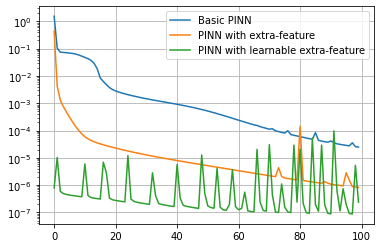

Tutorial 1: resolution of a Poisson problem
===========================================

The problem definition
~~~~~~~~~~~~~~~~~~~~~~

This tutorial presents how to solve with Physics-Informed Neural
Networks a 2-D Poisson problem with Dirichlet boundary conditions.

The problem is written as: :raw-latex:`\begin{equation}
\begin{cases}
\Delta u = \sin{(\pi x)} \sin{(\pi y)} \text{ in } D, \\
u = 0 \text{ on } \Gamma_1 \cup \Gamma_2 \cup \Gamma_3 \cup \Gamma_4,
\end{cases}
\end{equation}` where :math:`D` is a square domain :math:`[0,1]^2`, and
:math:`\Gamma_i`, with :math:`i=1,...,4`, are the boundaries of the
square.

First of all, some useful imports.

.. code:: ipython3

    import os
    import numpy as np
    import argparse
    import sys
    import torch
    from torch.nn import ReLU, Tanh, Softplus
    from pina.problem import SpatialProblem
    from pina.operators import nabla
    from pina.model import FeedForward
    from pina.adaptive_functions import AdaptiveSin, AdaptiveCos, AdaptiveTanh
    from pina import Condition, Span, PINN, LabelTensor, Plotter

Now, the Poisson problem is written in PINA code as a class. The
equations are written as *conditions* that should be satisfied in the
corresponding domains. *truth_solution* is the exact solution which will
be compared with the predicted one.

.. code:: ipython3

    class Poisson(SpatialProblem):
        spatial_variables = ['x', 'y']
        bounds_x = [0, 1]
        bounds_y = [0, 1]
        output_variables = ['u']
        domain = Span({'x': bounds_x, 'y': bounds_y})
    
        def laplace_equation(input_, output_):
            force_term = (torch.sin(input_['x']*torch.pi) *
                          torch.sin(input_['y']*torch.pi))
            return nabla(output_['u'], input_).flatten() - force_term
    
        def nil_dirichlet(input_, output_):
            value = 0.0
            return output_['u'] - value
    
        conditions = {
            'gamma1': Condition(Span({'x': bounds_x, 'y':  bounds_y[-1]}), nil_dirichlet),
            'gamma2': Condition(Span({'x': bounds_x, 'y': bounds_y[0]}), nil_dirichlet),
            'gamma3': Condition(Span({'x':  bounds_x[-1], 'y': bounds_y}), nil_dirichlet),
            'gamma4': Condition(Span({'x': bounds_x[0], 'y': bounds_y}), nil_dirichlet),
        'D': Condition(Span({'x': bounds_x, 'y': bounds_y}), laplace_equation),
        }
        def poisson_sol(self, x, y):
            return -(np.sin(x*np.pi)*np.sin(y*np.pi))/(2*np.pi**2)
    
        truth_solution = poisson_sol

The problem solution
~~~~~~~~~~~~~~~~~~~~

Then, a feed-forward neural network is defined, through the class
*FeedForward*. A 2-D grid is instantiated inside the square domain and
on the boundaries. This neural network takes as input the coordinates of
the points which compose the grid and gives as output the solution of
the Poisson problem. The residual of the equations are evaluated at each
point of the grid and the loss minimized by the neural network is the
sum of the residuals. In this tutorial, the neural network is composed
by two hidden layers of 10 neurons each, and it is trained for 5000
epochs with a learning rate of 0.003. These parameters can be modified
as desired. The output of the cell below is the final loss of the
training phase of the PINN.

.. code:: ipython3

    poisson_problem = Poisson()
    
    model = FeedForward(layers=[10, 10],
                        output_variables=poisson_problem.output_variables,
                        input_variables=poisson_problem.input_variables)
    
    pinn = PINN(poisson_problem, model, lr=0.003, regularizer=1e-8)
    pinn.span_pts(20, 'grid', ['D'])
    pinn.span_pts(20, 'grid', ['gamma1', 'gamma2', 'gamma3', 'gamma4'])
    pinn.train(5000, 100)

.. parsed-literal::

    2.384537034558816e-05

The loss trend is saved in a dedicated txt file located in
*tutorial1_files*.

.. code:: ipython3

    os.mkdir('tutorial1_files')
    with open('tutorial1_files/poisson_history.txt', 'w') as file_:
        for i, losses in enumerate(pinn.history):
            file_.write('{} {}\n'.format(i, sum(losses)))
    pinn.save_state('tutorial1_files/pina.poisson')

Now the *Plotter* class is used to plot the results. The solution
predicted by the neural network is plotted on the left, the exact one is
represented at the center and on the right the error between the exact
and the predicted solutions is showed.

.. code:: ipython3

    plotter = Plotter()
    plotter.plot(pinn)

.. image:: output_13_0.png

The problem solution with extra-features
~~~~~~~~~~~~~~~~~~~~~~~~~~~~~~~~~~~~~~~~

Now, the same problem is solved in a different way. A new neural network
is now defined, with an additional input variable, named extra-feature,
which coincides with the forcing term in the Laplace equation. The set
of input variables to the neural network is:

:raw-latex:`\begin{equation}
[\mathbf{x}, \mathbf{y}, \mathbf{k}(\mathbf{x}, \mathbf{y})], \text{ with } \mathbf{k}(\mathbf{x}, \mathbf{y})=\sin{(\pi \mathbf{x})}\sin{(\pi \mathbf{y})},
\end{equation}`

where :math:`\mathbf{x}` and :math:`\mathbf{y}` are the coordinates of
the points of the grid and :math:`\mathbf{k}(\mathbf{x}, \mathbf{y})` is
the forcing term evaluated at the grid points.

This forcing term is initialized in the class *myFeature*, the output of
the cell below is also in this case the final loss of PINN.

.. code:: ipython3

    poisson_problem = Poisson()
    
    class myFeature(torch.nn.Module):
        """
        """
        def __init__(self):
            super(myFeature, self).__init__()
    
        def forward(self, x):
            return (torch.sin(x['x']*torch.pi) *
                    torch.sin(x['y']*torch.pi))
        
    feat = [myFeature()]
    model_feat = FeedForward(layers=[10, 10],
                        output_variables=poisson_problem.output_variables,
                        input_variables=poisson_problem.input_variables,
                        extra_features=feat)
    
    pinn_feat = PINN(poisson_problem, model_feat, lr=0.003, regularizer=1e-8)
    pinn_feat.span_pts(20, 'grid', ['D'])
    pinn_feat.span_pts(20, 'grid', ['gamma1', 'gamma2', 'gamma3', 'gamma4'])
    pinn_feat.train(5000, 100)

.. parsed-literal::

    7.93498870023341e-07

The losses are saved in a txt file as for the basic Poisson case.

.. code:: ipython3

    with open('tutorial1_files/poisson_history_feat.txt', 'w') as file_:
            for i, losses in enumerate(pinn_feat.history):
                file_.write('{} {}\n'.format(i, sum(losses)))
    pinn_feat.save_state('tutorial1_files/pina.poisson_feat')

The predicted and exact solutions and the error between them are
represented below.

.. code:: ipython3

    plotter_feat = Plotter()
    plotter_feat.plot(pinn_feat)

.. image:: output_20_0.png

The problem solution with learnable extra-features
~~~~~~~~~~~~~~~~~~~~~~~~~~~~~~~~~~~~~~~~~~~~~~~~~~

Another way to predict the solution is to add a parametric forcing term
of the Laplace equation as an extra-feature. The parameters added in the
expression of the extra-feature are learned during the training phase of
the neural network. For example, considering two parameters, the
parameteric extra-feature is written as:

:raw-latex:`\begin{equation}
\mathbf{k}(\mathbf{x}, \mathbf{y}) = \beta \sin{(\alpha \mathbf{x})} \sin{(\alpha \mathbf{y})}
\end{equation}`

The new Poisson problem is defined in the dedicated class
*ParametricPoisson*, where the domain is no more only spatial, but
includes the parameters’ space. In our case, the parameters’ bounds are
0 and 30.

.. code:: ipython3

    from pina.problem import ParametricProblem
    
    class ParametricPoisson(SpatialProblem, ParametricProblem):
        bounds_x = [0, 1]
        bounds_y = [0, 1]
        bounds_alpha = [0, 30]
        bounds_beta = [0, 30]
        spatial_variables = ['x', 'y']
        parameters = ['alpha', 'beta']
        output_variables = ['u']
        domain = Span({'x': bounds_x, 'y': bounds_y})
    
        def laplace_equation(input_, output_):
            force_term = (torch.sin(input_['x']*torch.pi) *
                          torch.sin(input_['y']*torch.pi))
            return nabla(output_['u'], input_).flatten() - force_term
    
        def nil_dirichlet(input_, output_):
            value = 0.0
            return output_['u'] - value
    
        conditions = {
            'gamma1': Condition(
                Span({'x': bounds_x, 'y': bounds_y[1], 'alpha': bounds_alpha, 'beta': bounds_beta}),
                nil_dirichlet),
            'gamma2': Condition(
                Span({'x': bounds_x, 'y': bounds_y[0], 'alpha': bounds_alpha, 'beta': bounds_beta}),
                nil_dirichlet),
            'gamma3': Condition(
                Span({'x': bounds_x[1], 'y': bounds_y, 'alpha': bounds_alpha, 'beta': bounds_beta}),
                nil_dirichlet),
            'gamma4': Condition(
                Span({'x': bounds_x[0], 'y': bounds_y, 'alpha': bounds_alpha, 'beta': bounds_beta}),
                nil_dirichlet),
            'D': Condition(
                Span({'x': bounds_x, 'y': bounds_y, 'alpha': bounds_alpha, 'beta': bounds_beta}),
                laplace_equation),
        }
        
        def poisson_sol(self, x, y):
            return -(np.sin(x*np.pi)*np.sin(y*np.pi))/(2*np.pi**2)

Here, as done for the other cases, the new parametric feature is defined
and the neural network is re-initialized and trained, considering as two
additional parameters :math:`\alpha` and :math:`\beta`.

.. code:: ipython3

    param_poisson_problem = ParametricPoisson()
    
    class myFeature(torch.nn.Module):
        """
        """
        def __init__(self):
            super(myFeature, self).__init__()
    
        def forward(self, x):
            return (x['beta']*torch.sin(x['alpha']*x['x']*torch.pi)*
                   torch.sin(x['alpha']*x['y']*torch.pi))
    
    feat = [myFeature()]
    model_learn = FeedForward(layers=[10, 10],
                        output_variables=param_poisson_problem.output_variables,
                        input_variables=param_poisson_problem.input_variables,
                        extra_features=feat)
    
    pinn_learn = PINN(poisson_problem, model_feat, lr=0.003, regularizer=1e-8)
    pinn_learn.span_pts(20, 'grid', ['D'])
    pinn_learn.span_pts(20, 'grid', ['gamma1', 'gamma2', 'gamma3', 'gamma4'])
    pinn_learn.train(5000, 100)

.. parsed-literal::

    3.265163986679126e-06

The losses are saved as for the other two cases trained above.

.. code:: ipython3

    with open('tutorial1_files/poisson_history_learn_feat.txt', 'w') as file_:
        for i, losses in enumerate(pinn_learn.history):
            file_.write('{} {}\n'.format(i, sum(losses)))
    pinn_learn.save_state('tutorial1_files/pina.poisson_learn_feat')

Here the plots for the prediction error (below on the right) shows that
the prediction coming from the **parametric PINN** is more accurate than
the one of the basic version of PINN.

.. code:: ipython3

    plotter_learn = Plotter()
    plotter_learn.plot(pinn_learn)

.. image:: output_29_0.png

Now the files containing the loss trends for the three cases are read.
The loss histories are compared; we can see that the loss decreases
faster in the cases of PINN with extra-feature.

.. code:: ipython3

    import pandas as pd
      
    df = pd.read_csv("tutorial1_files/poisson_history.txt", sep=" ", header=None)
    epochs = df[0]
    poisson_data = epochs.to_numpy()*100
    basic = df[1].to_numpy()
    
    df_feat = pd.read_csv("tutorial1_files/poisson_history_feat.txt", sep=" ", header=None)
    feat = df_feat[1].to_numpy()
    
    df_learn = pd.read_csv("tutorial1_files/poisson_history_learn_feat.txt", sep=" ", header=None)
    learn_feat = df_learn[1].to_numpy()
    
    import matplotlib.pyplot as plt
    plt.semilogy(epochs, basic, label='Basic PINN')
    plt.semilogy(epochs, feat, label='PINN with extra-feature')
    plt.semilogy(epochs, learn_feat, label='PINN with learnable extra-feature')
    plt.legend()
    plt.grid()
    plt.show()

