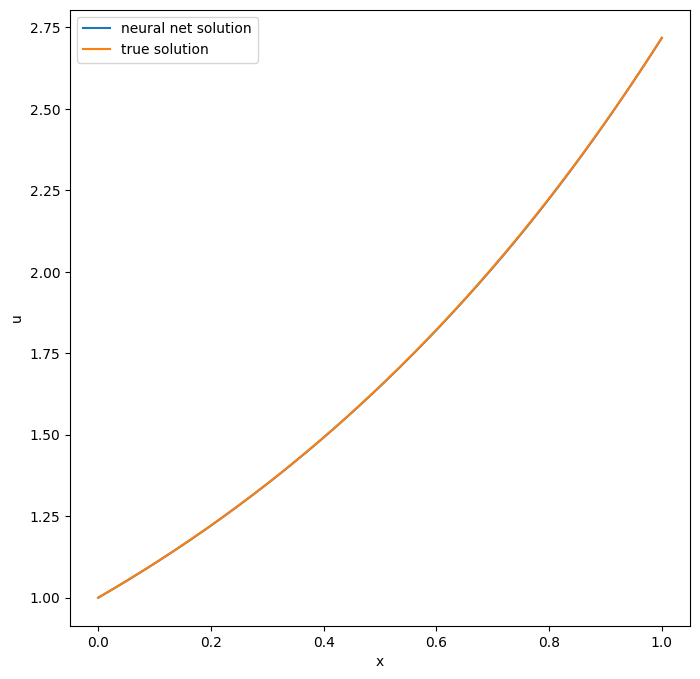

Tutorial 1: Physics Informed Neural Networks on PINA
====================================================

In this tutorial we will show the typical use case of PINA on a toy
problem solved by Physics Informed Problems. Specifically, the tutorial
aims to introduce the following topics:

-  Defining a PINA Problem,
-  Build a ``PINN`` Solver,

We will show in detailed each step, and at the end we will solve a very
simple problem with PINA.

Defining a Problem
------------------

Initialize the Problem class
~~~~~~~~~~~~~~~~~~~~~~~~~~~~

The problem definition in the PINA framework is done by building a
phython ``class``, inherited from ``AbsractProblem``. A problem is an
object which explains what the solver is supposed to solve. For Physics
Informed Neural Networks, a problem can be inherited from one or more
problem (already implemented) classes (``SpatialProblem``,
``TimeDependentProblem``, ``ParametricProblem``), depending on the
nature of the problem treated. Let’s see an example to better
understand: 

Simple Ordinary Differential Equation Consider the following:
~~~~~~~~~~~~~~~~~~~~~~~~~~~~~~~~~~~~~~~~~~~~~~~~~~~~~~~~~~~~~

.. math::
   \begin{cases}
    \frac{d}{dx}u(x) &=  u(x) \quad x\in(0,1)\\
    u(x=0) &= 1 \\
   \end{cases}

with analytical solution :math:`u(x) = e^x`. In this case we have that
our ODE depends only on the spatial variable :math:`x\in(0,1)` , this
means that our problem class is going to be inherited from
``SpatialProblem`` class:

.. code:: python

   from pina.problem import SpatialProblem
   from pina.geometry import CartesianDomain

   class SimpleODE(SpatialProblem):
       
       output_variables = ['u']
       spatial_domain = CartesianDomain({'x': [0, 1]})

       # other stuff ...

Notice that we define ``output_variables`` as a list of symbols,
indicating the output variables of our equation (in this case only
:math:`u`). The ``spatial_domain`` variable indicates where the sample
points are going to be sampled in the domain, in this case
:math:`x\in(0,1)`

What about if we also have a time depencency in the equation? Well in
that case our ``class`` will inherit from both ``SpatialProblem`` and
``TimeDependentProblem``:

.. code:: python

   from pina.problem import SpatialProblem, TimeDependentProblem
   from pina.geometry import CartesianDomain

   class TimeSpaceODE(SpatialProblem, TimeDependentProblem):
       
       output_variables = ['u']
       spatial_domain = CartesianDomain({'x': [0, 1]})
       temporal_domain = CartesianDomain({'x': [0, 1]})

       # other stuff ...

where we have included the ``temporal_domain`` variable indicating the
time domain where we want the solution.

Summarizing, in PINA we can initialize a problem with a class which is
inherited from three base classes: ``SpatialProblem``,
``TimeDependentProblem``, ``ParametricProblem``, depending on the type
of problem we are considering. For reference: \* ``SpatialProblem``
:math:`\rightarrow` spatial variable(s) presented in the differential
equation \* ``TimeDependentProblem`` :math:`\rightarrow` time
variable(s) presented in the differential equation \*
``ParametricProblem`` :math:`\rightarrow` parameter(s) presented in the
differential equation

Write the problem class
~~~~~~~~~~~~~~~~~~~~~~~

Once the problem class is initialized we need to write the differential
equation in PINA language. For doing this we need to load the pina
operators found in ``pina.operators`` module. Let’s again consider the
Equation (1) and try to write the PINA model class:

.. code:: ipython3

    from pina.problem import SpatialProblem
    from pina.operators import grad
    from pina.geometry import CartesianDomain
    from pina.equation import Equation
    from pina import Condition
    
    import torch
    
    
    class SimpleODE(SpatialProblem):
    
        output_variables = ['u']
        spatial_domain = CartesianDomain({'x': [0, 1]})
    
        # defining the ode equation
        def ode_equation(input_, output_):
    
            # computing the derivative
            u_x = grad(output_, input_, components=['u'], d=['x'])
    
            # extracting u input variable
            u = output_.extract(['u'])
    
            # calculate residual and return it
            return u_x - u
    
        # defining initial condition
        def initial_condition(input_, output_):
            
            # setting initial value
            value = 1.0
    
            # extracting u input variable
            u = output_.extract(['u'])
    
            # calculate residual and return it
            return u - value
    
        # Conditions to hold
        conditions = {
            'x0': Condition(location=CartesianDomain({'x': 0.}), equation=Equation(initial_condition)),
            'D': Condition(location=CartesianDomain({'x': [0, 1]}), equation=Equation(ode_equation)),
        }
    
        # defining true solution
        def truth_solution(self, pts):
            return torch.exp(pts.extract(['x']))

After the defition of the Class we need to write different class
methods, where each method is a function returning a residual. This
functions are the ones minimized during the PINN optimization, for the
different conditions. For example, in the domain :math:`(0,1)` the ODE
equation (``ode_equation``) must be satisfied, so we write it by putting
all the ODE equation on the right hand side, such that we return the
zero residual. This is done for all the conditions (``ode_equation``,
``initial_condition``). Notice that we do not pass directly a ``python``
function, but an ``Equation`` object, which is initialized with the
``python`` function. This is done so that all the computations, and
internal checks are done inside PINA.

Once we have defined the function we need to tell the network where
these methods have to be applied. For doing this we use the class
``Condition``. In ``Condition`` we pass the location points and the
function to be minimized on those points (other possibilities are
allowed, see the documentation for reference).

Finally, it’s possible to defing the ``truth_solution`` function, which
can be useful if we want to plot the results and see a comparison of
real vs expected solution. Notice that ``truth_solution`` function is a
method of the ``PINN`` class, but it is not mandatory for the problem
definition.

Build PINN object
-----------------

In PINA we have already developed different solvers, one of them is
``PINN``. The basics requirements for building a ``PINN`` model are a
problem and a model. We have already covered the problem definition. For
the model one can use the default models provided in PINA or use a
custom model. We will not go into the details of model definition,
Tutorial2 and Tutorial3 treat the topic in detail.

.. code:: ipython3

    from pina.model import FeedForward
    from pina.solvers import PINN
    
    # initialize the problem
    problem = SimpleODE()
    
    # build the model
    model = FeedForward(
        layers=[10, 10],
        func=torch.nn.Tanh,
        output_dimensions=len(problem.output_variables),
        input_dimensions=len(problem.input_variables)
    )
    
    # create the PINN object, see the PINN documentation for extra argument in the constructor
    pinn = PINN(problem, model)

Creating the pinn object is fairly simple by using the ``PINN`` class,
different optional inputs can be passed: optimizer, batch size, … (see
`documentation <https://mathlab.github.io/PINA/>`__ for reference).

Sample points in the domain and create the Trainer
--------------------------------------------------

Once the ``PINN`` object is created, we need to generate the points for
starting the optimization. For doing this we use the
``.discretise_domain`` method of the ``AbstractProblem`` class. Let’s
see some methods to sample in :math:`(0,1 )`.

.. code:: ipython3

    # sampling 20 points in (0, 1) with discrite step
    problem.discretise_domain(20, 'grid', locations=['D'])
    
    # sampling 20 points in (0, 1) with latin hypercube
    problem.discretise_domain(20, 'latin', locations=['D'])
    
    # sampling 20 points in (0, 1) randomly
    problem.discretise_domain(20, 'random', locations=['D'])

We are going to use equispaced points for sampling. We need to sample in
all the conditions domains. In our case we sample in ``D`` and ``x0``.

.. code:: ipython3

    # sampling for training
    problem.discretise_domain(1, 'random', locations=['x0'])
    problem.discretise_domain(20, 'grid', locations=['D'])

Very simple training and plotting
~~~~~~~~~~~~~~~~~~~~~~~~~~~~~~~~~

Once we have defined the PINA model, created a network and sampled
points in the domain, we have everything that is necessary for training
a ``PINN``. For training we use the ``Trainer`` class. Here we show a
very short training and some method for plotting the results. Notice
that by default all relevant metrics (e.g. MSE error during training) is
going to be tracked using a ``lightining`` logger, by default
``CSVLogger``. If you want to track the metric by yourself without a
logger, use ``pina.callbacks.MetricTracker``.

.. code:: ipython3

    # create the trainer
    from pina.trainer import Trainer
    from pina.callbacks import MetricTracker
    
    trainer = Trainer(solver=pinn, max_epochs=3000, callbacks=[MetricTracker()])
    
    # train
    trainer.train()

.. parsed-literal::

    GPU available: False, used: False
    TPU available: False, using: 0 TPU cores
    IPU available: False, using: 0 IPUs
    HPU available: False, using: 0 HPUs
    /Users/dariocoscia/anaconda3/envs/pina/lib/python3.9/site-packages/lightning/pytorch/trainer/connectors/logger_connector/logger_connector.py:67: UserWarning: Starting from v1.9.0, `tensorboardX` has been removed as a dependency of the `lightning.pytorch` package, due to potential conflicts with other packages in the ML ecosystem. For this reason, `logger=True` will use `CSVLogger` as the default logger, unless the `tensorboard` or `tensorboardX` packages are found. Please `pip install lightning[extra]` or one of them to enable TensorBoard support by default
      warning_cache.warn(
    
      | Name        | Type    | Params
    ----------------------------------------
    0 | _loss       | MSELoss | 0     
    1 | _neural_net | Network | 141   
    ----------------------------------------
    141       Trainable params
    0         Non-trainable params
    141       Total params
    0.001     Total estimated model params size (MB)

.. parsed-literal::

    Epoch 2999: : 1it [00:00, 226.55it/s, v_num=10, mean_loss=2.14e-5, x0_loss=4.24e-5, D_loss=2.93e-7]  

.. parsed-literal::

    `Trainer.fit` stopped: `max_epochs=3000` reached.

.. parsed-literal::

    Epoch 2999: : 1it [00:00, 159.67it/s, v_num=10, mean_loss=2.14e-5, x0_loss=4.24e-5, D_loss=2.93e-7]

After the training we can inspect trainer logged metrics (by default
PINA logs mean square error residual loss). The logged metrics can be
accessed online using one of the ``Lightinig`` loggers. The final loss
can be accessed by ``trainer.logged_metrics``.

.. code:: ipython3

    # inspecting final loss
    trainer.logged_metrics

.. parsed-literal::

    {'mean_loss': tensor(2.1357e-05),
     'x0_loss': tensor(4.2421e-05),
     'D_loss': tensor(2.9291e-07)}

By using the ``Plotter`` class from PINA we can also do some quatitative
plots of the solution.

.. code:: ipython3

    from pina.plotter import Plotter
    
    # plotting the loss
    plotter = Plotter()
    plotter.plot(trainer=trainer)

.. image:: tutorial_files/tutorial_21_0.png

The solution is completely overlapped with the actual one. We can also
plot easily the loss:

.. code:: ipython3

    plotter.plot_loss(trainer=trainer, metric='mean_loss', log_scale=True)

