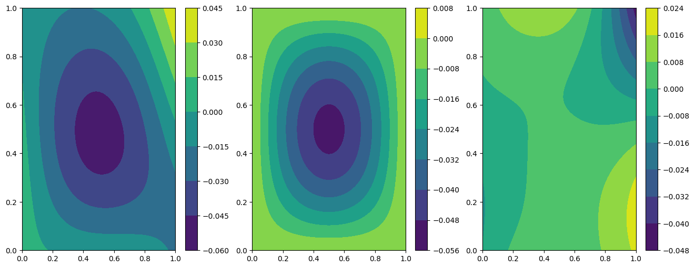
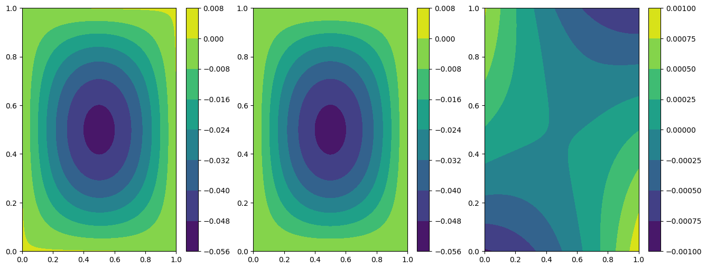
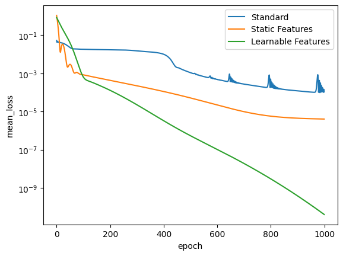

Tutorial 2: resolution of Poisson problem and usage of extra-features
=====================================================================

The problem definition
~~~~~~~~~~~~~~~~~~~~~~

This tutorial presents how to solve with Physics-Informed Neural
Networks a 2D Poisson problem with Dirichlet boundary conditions. Using
extrafeatures.

The problem is written as: :raw-latex:`\begin{equation}
\begin{cases}
\Delta u = \sin{(\pi x)} \sin{(\pi y)} \text{ in } D, \\
u = 0 \text{ on } \Gamma_1 \cup \Gamma_2 \cup \Gamma_3 \cup \Gamma_4,
\end{cases}
\end{equation}` where :math:`D` is a square domain :math:`[0,1]^2`, and
:math:`\Gamma_i`, with :math:`i=1,...,4`, are the boundaries of the
square.

First of all, some useful imports.

.. code:: ipython3

    import torch
    from torch.nn import Softplus
    
    from pina.problem import SpatialProblem
    from pina.operators import laplacian
    from pina.model import FeedForward
    from pina.solvers import PINN
    from pina.trainer import Trainer
    from pina.plotter import Plotter
    from pina.geometry import CartesianDomain
    from pina.equation import Equation, FixedValue
    from pina import Condition, LabelTensor
    from pina.callbacks import MetricTracker

Now, the Poisson problem is written in PINA code as a class. The
equations are written as *conditions* that should be satisfied in the
corresponding domains. *truth_solution* is the exact solution which will
be compared with the predicted one.

.. code:: ipython3

    class Poisson(SpatialProblem):
        output_variables = ['u']
        spatial_domain = CartesianDomain({'x': [0, 1], 'y': [0, 1]})
    
        def laplace_equation(input_, output_):
            force_term = (torch.sin(input_.extract(['x'])*torch.pi) *
                          torch.sin(input_.extract(['y'])*torch.pi))
            laplacian_u = laplacian(output_, input_, components=['u'], d=['x', 'y'])
            return laplacian_u - force_term
    
        conditions = {
            'gamma1': Condition(location=CartesianDomain({'x': [0, 1], 'y':  1}), equation=FixedValue(0.)),
            'gamma2': Condition(location=CartesianDomain({'x': [0, 1], 'y': 0}), equation=FixedValue(0.)),
            'gamma3': Condition(location=CartesianDomain({'x':  1, 'y': [0, 1]}), equation=FixedValue(0.)),
            'gamma4': Condition(location=CartesianDomain({'x': 0, 'y': [0, 1]}), equation=FixedValue(0.)),
            'D': Condition(location=CartesianDomain({'x': [0, 1], 'y': [0, 1]}), equation=Equation(laplace_equation)),
        }
    
        def poisson_sol(self, pts):
            return -(
                torch.sin(pts.extract(['x'])*torch.pi)*
                torch.sin(pts.extract(['y'])*torch.pi)
            )/(2*torch.pi**2)
        
        truth_solution = poisson_sol
    
    problem = Poisson()
    
    # let's discretise the domain
    problem.discretise_domain(25, 'grid', locations=['D'])
    problem.discretise_domain(25, 'grid', locations=['gamma1', 'gamma2', 'gamma3', 'gamma4'])

The problem solution
~~~~~~~~~~~~~~~~~~~~

After the problem, the feed-forward neural network is defined, through
the class ``FeedForward``. This neural network takes as input the
coordinates (in this case :math:`x` and :math:`y`) and provides the
unkwown field of the Poisson problem. The residual of the equations are
evaluated at several sampling points (which the user can manipulate
using the method ``CartesianDomain_pts``) and the loss minimized by the
neural network is the sum of the residuals.

In this tutorial, the neural network is composed by two hidden layers of
10 neurons each, and it is trained for 1000 epochs with a learning rate
of 0.006. These parameters can be modified as desired.

.. code:: ipython3

    # make model + solver + trainer
    model = FeedForward(
        layers=[10, 10],
        func=Softplus,
        output_dimensions=len(problem.output_variables),
        input_dimensions=len(problem.input_variables)
    )
    pinn = PINN(problem, model, optimizer_kwargs={'lr':0.006, 'weight_decay':1e-8})
    trainer = Trainer(pinn, max_epochs=1000, callbacks=[MetricTracker()])
    
    # train
    trainer.train()

.. parsed-literal::

    GPU available: False, used: False
    TPU available: False, using: 0 TPU cores
    IPU available: False, using: 0 IPUs
    HPU available: False, using: 0 HPUs
    /Users/dariocoscia/anaconda3/envs/pina/lib/python3.9/site-packages/lightning/pytorch/trainer/connectors/logger_connector/logger_connector.py:67: UserWarning: Starting from v1.9.0, `tensorboardX` has been removed as a dependency of the `lightning.pytorch` package, due to potential conflicts with other packages in the ML ecosystem. For this reason, `logger=True` will use `CSVLogger` as the default logger, unless the `tensorboard` or `tensorboardX` packages are found. Please `pip install lightning[extra]` or one of them to enable TensorBoard support by default
      warning_cache.warn(
    
      | Name        | Type    | Params
    ----------------------------------------
    0 | _loss       | MSELoss | 0     
    1 | _neural_net | Network | 151   
    ----------------------------------------
    151       Trainable params
    0         Non-trainable params
    151       Total params
    0.001     Total estimated model params size (MB)

.. parsed-literal::

    Epoch 999: : 1it [00:00, 129.50it/s, v_num=45, mean_loss=0.00196, gamma1_loss=0.0093, gamma2_loss=0.000146, gamma3_loss=8.16e-5, gamma4_loss=0.000201, D_loss=8.44e-5]  

.. parsed-literal::

    `Trainer.fit` stopped: `max_epochs=1000` reached.

.. parsed-literal::

    Epoch 999: : 1it [00:00, 101.25it/s, v_num=45, mean_loss=0.00196, gamma1_loss=0.0093, gamma2_loss=0.000146, gamma3_loss=8.16e-5, gamma4_loss=0.000201, D_loss=8.44e-5]

Now the *Plotter* class is used to plot the results. The solution
predicted by the neural network is plotted on the left, the exact one is
represented at the center and on the right the error between the exact
and the predicted solutions is showed.

.. code:: ipython3

    plotter = Plotter()
    plotter.plot(trainer)

The problem solution with extra-features
~~~~~~~~~~~~~~~~~~~~~~~~~~~~~~~~~~~~~~~~

Now, the same problem is solved in a different way. A new neural network
is now defined, with an additional input variable, named extra-feature,
which coincides with the forcing term in the Laplace equation. The set
of input variables to the neural network is:

:raw-latex:`\begin{equation}
[x, y, k(x, y)], \text{ with } k(x, y)=\sin{(\pi x)}\sin{(\pi y)},
\end{equation}`

where :math:`x` and :math:`y` are the spatial coordinates and
:math:`k(x, y)` is the added feature.

This feature is initialized in the class ``SinSin``, which needs to be
inherited by the ``torch.nn.Module`` class and to have the ``forward``
method. After declaring such feature, we can just incorporate in the
``FeedForward`` class thanks to the ``extra_features`` argument. **NB**:
``extra_features`` always needs a ``list`` as input, you you have one
feature just encapsulated it in a class, as in the next cell.

Finally, we perform the same training as before: the problem is
``Poisson``, the network is composed by the same number of neurons and
optimizer parameters are equal to previous test, the only change is the
new extra feature.

.. code:: ipython3

    class SinSin(torch.nn.Module):
        """Feature: sin(x)*sin(y)"""
        def __init__(self):
            super().__init__()
    
        def forward(self, x):
            t = (torch.sin(x.extract(['x'])*torch.pi) *
                 torch.sin(x.extract(['y'])*torch.pi))
            return LabelTensor(t, ['sin(x)sin(y)'])
    
    
    # make model + solver + trainer
    model_feat = FeedForward(
        layers=[10, 10],
        func=Softplus,
        output_dimensions=len(problem.output_variables),
        input_dimensions=len(problem.input_variables)+1
    )
    pinn_feat = PINN(problem, model_feat, extra_features=[SinSin()], optimizer_kwargs={'lr':0.006, 'weight_decay':1e-8})
    trainer_feat = Trainer(pinn_feat, max_epochs=1000, callbacks=[MetricTracker()])
    
    # train
    trainer_feat.train()

.. parsed-literal::

    GPU available: False, used: False
    TPU available: False, using: 0 TPU cores
    IPU available: False, using: 0 IPUs
    HPU available: False, using: 0 HPUs
    
      | Name        | Type    | Params
    ----------------------------------------
    0 | _loss       | MSELoss | 0     
    1 | _neural_net | Network | 161   
    ----------------------------------------
    161       Trainable params
    0         Non-trainable params
    161       Total params
    0.001     Total estimated model params size (MB)

.. parsed-literal::

    Epoch 999: : 1it [00:00, 112.55it/s, v_num=46, mean_loss=2.73e-7, gamma1_loss=1.13e-6, gamma2_loss=7.1e-8, gamma3_loss=4.69e-8, gamma4_loss=6.81e-8, D_loss=4.65e-8]    

.. parsed-literal::

    `Trainer.fit` stopped: `max_epochs=1000` reached.

.. parsed-literal::

    Epoch 999: : 1it [00:00, 92.69it/s, v_num=46, mean_loss=2.73e-7, gamma1_loss=1.13e-6, gamma2_loss=7.1e-8, gamma3_loss=4.69e-8, gamma4_loss=6.81e-8, D_loss=4.65e-8] 

The predicted and exact solutions and the error between them are
represented below. We can easily note that now our network, having
almost the same condition as before, is able to reach additional order
of magnitudes in accuracy.

.. code:: ipython3

    plotter.plot(trainer_feat)

The problem solution with learnable extra-features
~~~~~~~~~~~~~~~~~~~~~~~~~~~~~~~~~~~~~~~~~~~~~~~~~~

We can still do better!

Another way to exploit the extra features is the addition of learnable
parameter inside them. In this way, the added parameters are learned
during the training phase of the neural network. In this case, we use:

:raw-latex:`\begin{equation}
k(x, \mathbf{y}) = \beta \sin{(\alpha x)} \sin{(\alpha y)},
\end{equation}`

where :math:`\alpha` and :math:`\beta` are the abovementioned
parameters. Their implementation is quite trivial: by using the class
``torch.nn.Parameter`` we cam define all the learnable parameters we
need, and they are managed by ``autograd`` module!

.. code:: ipython3

    class SinSinAB(torch.nn.Module):
        """ """
        def __init__(self):
            super().__init__()
            self.alpha = torch.nn.Parameter(torch.tensor([1.0]))
            self.beta = torch.nn.Parameter(torch.tensor([1.0]))
    
    
        def forward(self, x):
            t =  (
                self.beta*torch.sin(self.alpha*x.extract(['x'])*torch.pi)*
                          torch.sin(self.alpha*x.extract(['y'])*torch.pi)
            )
            return LabelTensor(t, ['b*sin(a*x)sin(a*y)'])
    
    
    # make model + solver + trainer
    model_lean= FeedForward(
        layers=[10, 10],
        func=Softplus,
        output_dimensions=len(problem.output_variables),
        input_dimensions=len(problem.input_variables)+1
    )
    pinn_lean = PINN(problem, model_lean, extra_features=[SinSin()], optimizer_kwargs={'lr':0.006, 'weight_decay':1e-8})
    trainer_learn = Trainer(pinn_lean, max_epochs=1000)
    
    # train
    trainer_learn.train()

.. parsed-literal::

    GPU available: False, used: False
    TPU available: False, using: 0 TPU cores
    IPU available: False, using: 0 IPUs
    HPU available: False, using: 0 HPUs
    
      | Name        | Type    | Params
    ----------------------------------------
    0 | _loss       | MSELoss | 0     
    1 | _neural_net | Network | 161   
    ----------------------------------------
    161       Trainable params
    0         Non-trainable params
    161       Total params
    0.001     Total estimated model params size (MB)

.. parsed-literal::

    Epoch 999: : 1it [00:00, 91.07it/s, v_num=47, mean_loss=2.11e-6, gamma1_loss=1.03e-5, gamma2_loss=4.17e-8, gamma3_loss=4.28e-8, gamma4_loss=5.65e-8, D_loss=6.21e-8]    

.. parsed-literal::

    `Trainer.fit` stopped: `max_epochs=1000` reached.

.. parsed-literal::

    Epoch 999: : 1it [00:00, 76.19it/s, v_num=47, mean_loss=2.11e-6, gamma1_loss=1.03e-5, gamma2_loss=4.17e-8, gamma3_loss=4.28e-8, gamma4_loss=5.65e-8, D_loss=6.21e-8]

Umh, the final loss is not appreciabily better than previous model (with
static extra features), despite the usage of learnable parameters. This
is mainly due to the over-parametrization of the network: there are many
parameter to optimize during the training, and the model in unable to
understand automatically that only the parameters of the extra feature
(and not the weights/bias of the FFN) should be tuned in order to fit
our problem. A longer training can be helpful, but in this case the
faster way to reach machine precision for solving the Poisson problem is
removing all the hidden layers in the ``FeedForward``, keeping only the
:math:`\alpha` and :math:`\beta` parameters of the extra feature.

.. code:: ipython3

    # make model + solver + trainer
    model_lean= FeedForward(
        layers=[],
        func=Softplus,
        output_dimensions=len(problem.output_variables),
        input_dimensions=len(problem.input_variables)+1
    )
    pinn_learn = PINN(problem, model_lean, extra_features=[SinSin()], optimizer_kwargs={'lr':0.006, 'weight_decay':1e-8})
    trainer_learn = Trainer(pinn_learn, max_epochs=1000, callbacks=[MetricTracker()])
    
    # train
    trainer_learn.train()

.. parsed-literal::

    GPU available: False, used: False
    TPU available: False, using: 0 TPU cores
    IPU available: False, using: 0 IPUs
    HPU available: False, using: 0 HPUs
    
      | Name        | Type    | Params
    ----------------------------------------
    0 | _loss       | MSELoss | 0     
    1 | _neural_net | Network | 4     
    ----------------------------------------
    4         Trainable params
    0         Non-trainable params
    4         Total params
    0.000     Total estimated model params size (MB)

.. parsed-literal::

    Epoch 999: : 1it [00:00, 149.45it/s, v_num=48, mean_loss=1.34e-16, gamma1_loss=6.66e-16, gamma2_loss=2.6e-18, gamma3_loss=4.84e-19, gamma4_loss=2.59e-18, D_loss=4.84e-19] 

.. parsed-literal::

    `Trainer.fit` stopped: `max_epochs=1000` reached.

.. parsed-literal::

    Epoch 999: : 1it [00:00, 117.81it/s, v_num=48, mean_loss=1.34e-16, gamma1_loss=6.66e-16, gamma2_loss=2.6e-18, gamma3_loss=4.84e-19, gamma4_loss=2.59e-18, D_loss=4.84e-19]

In such a way, the model is able to reach a very high accuracy! Of
course, this is a toy problem for understanding the usage of extra
features: similar precision could be obtained if the extra features are
very similar to the true solution. The analyzed Poisson problem shows a
forcing term very close to the solution, resulting in a perfect problem
to address with such an approach.

We conclude here by showing the graphical comparison of the unknown
field and the loss trend for all the test cases presented here: the
standard PINN, PINN with extra features, and PINN with learnable extra
features.

.. code:: ipython3

    plotter.plot(trainer_learn)

.. code:: ipython3

    import matplotlib.pyplot as plt
    
    plt.figure(figsize=(16, 6))
    plotter.plot_loss(trainer, label='Standard')
    plotter.plot_loss(trainer_feat, label='Static Features')
    plotter.plot_loss(trainer_learn, label='Learnable Features')
    
    plt.grid()
    plt.legend()
    plt.show()

