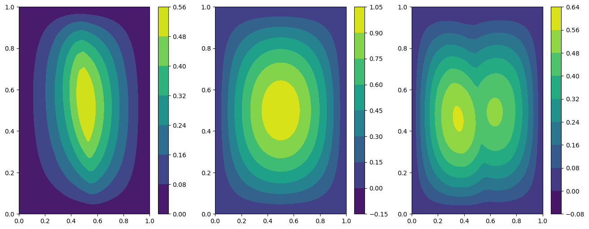
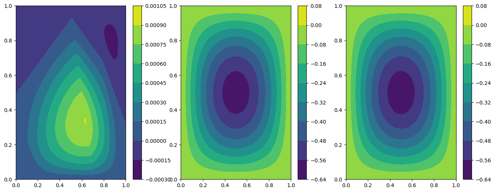
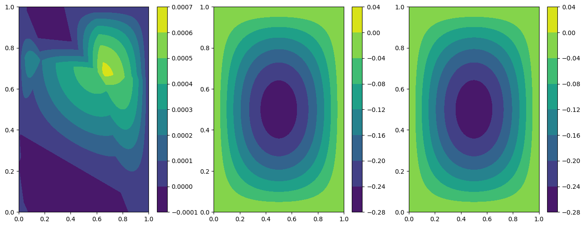
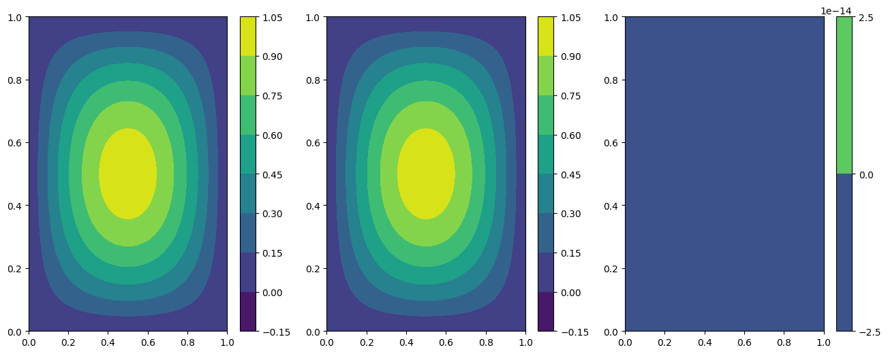
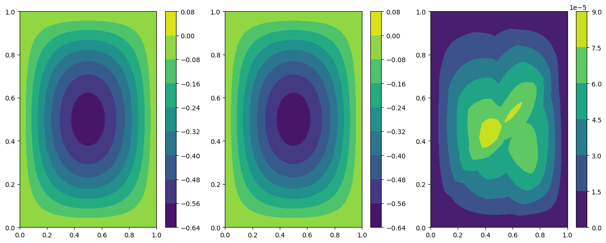
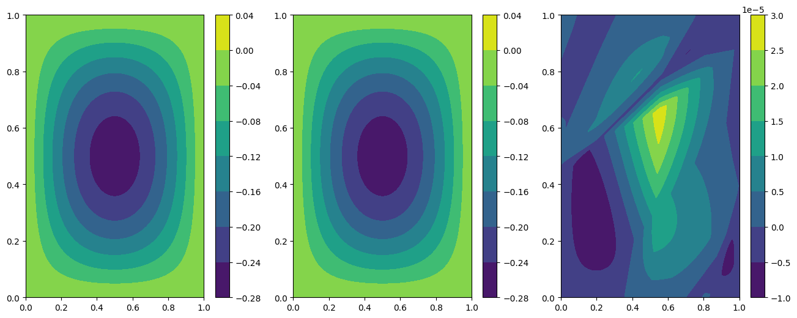

Tutorial: Two dimensional Wave problem with hard constraint
===========================================================

In this tutorial we present how to solve the wave equation using hard
constraint PINNs. For doing so we will build a costum ``torch`` model
and pass it to the ``PINN`` solver.

First of all, some useful imports.

.. code:: ipython3

    import torch
    
    from pina.problem import SpatialProblem, TimeDependentProblem
    from pina.operators import laplacian, grad
    from pina.geometry import CartesianDomain
    from pina.solvers import PINN
    from pina.trainer import Trainer
    from pina.equation import Equation
    from pina.equation.equation_factory import FixedValue
    from pina import Condition, Plotter

The problem definition
----------------------

The problem is written in the following form:

:raw-latex:`\begin{equation}
\begin{cases}
\Delta u(x,y,t) = \frac{\partial^2}{\partial t^2} u(x,y,t) \quad \text{in } D, \\\\
u(x, y, t=0) = \sin(\pi x)\sin(\pi y), \\\\
u(x, y, t) = 0 \quad \text{on } \Gamma_1 \cup \Gamma_2 \cup \Gamma_3 \cup \Gamma_4,
\end{cases}
\end{equation}`

where :math:`D` is a square domain :math:`[0,1]^2`, and
:math:`\Gamma_i`, with :math:`i=1,...,4`, are the boundaries of the
square, and the velocity in the standard wave equation is fixed to one.

Now, the wave problem is written in PINA code as a class, inheriting
from ``SpatialProblem`` and ``TimeDependentProblem`` since we deal with
spatial, and time dependent variables. The equations are written as
``conditions`` that should be satisfied in the corresponding domains.
``truth_solution`` is the exact solution which will be compared with the
predicted one.

.. code:: ipython3

    class Wave(TimeDependentProblem, SpatialProblem):
        output_variables = ['u']
        spatial_domain = CartesianDomain({'x': [0, 1], 'y': [0, 1]})
        temporal_domain = CartesianDomain({'t': [0, 1]})
    
        def wave_equation(input_, output_):
            u_t = grad(output_, input_, components=['u'], d=['t'])
            u_tt = grad(u_t, input_, components=['dudt'], d=['t'])
            nabla_u = laplacian(output_, input_, components=['u'], d=['x', 'y'])
            return nabla_u - u_tt
    
        def initial_condition(input_, output_):
            u_expected = (torch.sin(torch.pi*input_.extract(['x'])) *
                          torch.sin(torch.pi*input_.extract(['y'])))
            return output_.extract(['u']) - u_expected
    
        conditions = {
            'gamma1': Condition(location=CartesianDomain({'x': [0, 1], 'y':  1, 't': [0, 1]}), equation=FixedValue(0.)),
            'gamma2': Condition(location=CartesianDomain({'x': [0, 1], 'y': 0, 't': [0, 1]}), equation=FixedValue(0.)),
            'gamma3': Condition(location=CartesianDomain({'x':  1, 'y': [0, 1], 't': [0, 1]}), equation=FixedValue(0.)),
            'gamma4': Condition(location=CartesianDomain({'x': 0, 'y': [0, 1], 't': [0, 1]}), equation=FixedValue(0.)),
            't0': Condition(location=CartesianDomain({'x': [0, 1], 'y': [0, 1], 't': 0}), equation=Equation(initial_condition)),
            'D': Condition(location=CartesianDomain({'x': [0, 1], 'y': [0, 1], 't': [0, 1]}), equation=Equation(wave_equation)),
        }
    
        def wave_sol(self, pts):
            return (torch.sin(torch.pi*pts.extract(['x'])) *
                    torch.sin(torch.pi*pts.extract(['y'])) *
                    torch.cos(torch.sqrt(torch.tensor(2.))*torch.pi*pts.extract(['t'])))
    
        truth_solution = wave_sol
    
    problem = Wave()

Hard Constraint Model
---------------------

After the problem, a **torch** model is needed to solve the PINN.
Usually, many models are already implemented in **PINA**, but the user
has the possibility to build his/her own model in ``torch``. The hard
constraint we impose is on the boundary of the spatial domain.
Specifically, our solution is written as:

.. math::  u_{\rm{pinn}} = xy(1-x)(1-y)\cdot NN(x, y, t), 

where :math:`NN` is the neural net output. This neural network takes as
input the coordinates (in this case :math:`x`, :math:`y` and :math:`t`)
and provides the unknown field :math:`u`. By construction, it is zero on
the boundaries. The residuals of the equations are evaluated at several
sampling points (which the user can manipulate using the method
``discretise_domain``) and the loss minimized by the neural network is
the sum of the residuals.

.. code:: ipython3

    class HardMLP(torch.nn.Module):
    
        def __init__(self, input_dim, output_dim):
            super().__init__()
    
            self.layers = torch.nn.Sequential(torch.nn.Linear(input_dim, 40),
                                              torch.nn.ReLU(),
                                              torch.nn.Linear(40, 40),
                                              torch.nn.ReLU(),
                                              torch.nn.Linear(40, output_dim))
            
        # here in the foward we implement the hard constraints
        def forward(self, x):
            hard = x.extract(['x'])*(1-x.extract(['x']))*x.extract(['y'])*(1-x.extract(['y']))
            return hard*self.layers(x)

Train and Inference
-------------------

In this tutorial, the neural network is trained for 1000 epochs with a
learning rate of 0.001 (default in ``PINN``). Training takes
approximately 3 minutes.

.. code:: ipython3

    # generate the data
    problem.discretise_domain(1000, 'random', locations=['D', 't0', 'gamma1', 'gamma2', 'gamma3', 'gamma4'])
    
    # crete the solver
    pinn = PINN(problem, HardMLP(len(problem.input_variables), len(problem.output_variables)))
    
    # create trainer and train
    trainer = Trainer(pinn, max_epochs=1000, accelerator='cpu', enable_model_summary=False) # we train on CPU and avoid model summary at beginning of training (optional)
    trainer.train()

.. parsed-literal::

    /u/d/dcoscia/.local/lib/python3.9/site-packages/torch/cuda/__init__.py:546: UserWarning: Can't initialize NVML
      warnings.warn("Can't initialize NVML")
    /u/d/dcoscia/.local/lib/python3.9/site-packages/torch/cuda/__init__.py:651: UserWarning: CUDA initialization: CUDA unknown error - this may be due to an incorrectly set up environment, e.g. changing env variable CUDA_VISIBLE_DEVICES after program start. Setting the available devices to be zero. (Triggered internally at ../c10/cuda/CUDAFunctions.cpp:109.)
      return torch._C._cuda_getDeviceCount() if nvml_count < 0 else nvml_count
    GPU available: False, used: False
    TPU available: False, using: 0 TPU cores
    IPU available: False, using: 0 IPUs
    HPU available: False, using: 0 HPUs

.. parsed-literal::

    Training: 0it [00:00, ?it/s]

.. parsed-literal::

    `Trainer.fit` stopped: `max_epochs=1000` reached.

Notice that the loss on the boundaries of the spatial domain is exactly
zero, as expected! After the training is completed one can now plot some
results using the ``Plotter`` class of **PINA**.

.. code:: ipython3

    plotter = Plotter()
    
    # plotting at fixed time t = 0.0
    print('Plotting at t=0')
    plotter.plot(trainer, fixed_variables={'t': 0.0})
    
    # plotting at fixed time t = 0.5
    print('Plotting at t=0.5')
    plotter.plot(trainer, fixed_variables={'t': 0.5})
    
    # plotting at fixed time t = 1.
    print('Plotting at t=1')
    plotter.plot(trainer, fixed_variables={'t': 1.0})

.. parsed-literal::

    Plotting at t=0

.. parsed-literal::

    Plotting at t=0.5

.. parsed-literal::

    Plotting at t=1

The results are not so great, and we can clearly see that as time
progress the solution get worse…. Can we do better?

A valid option is to impose the initial condition as hard constraint as
well. Specifically, our solution is written as:

.. math::  u_{\rm{pinn}} = xy(1-x)(1-y)\cdot NN(x, y, t)\cdot t + \cos(\sqrt{2}\pi t)sin(\pi x)\sin(\pi y), 

Let us build the network first

.. code:: ipython3

    class HardMLPtime(torch.nn.Module):
    
        def __init__(self, input_dim, output_dim):
            super().__init__()
    
            self.layers = torch.nn.Sequential(torch.nn.Linear(input_dim, 40),
                                              torch.nn.ReLU(),
                                              torch.nn.Linear(40, 40),
                                              torch.nn.ReLU(),
                                              torch.nn.Linear(40, output_dim))
            
        # here in the foward we implement the hard constraints
        def forward(self, x):
            hard_space = x.extract(['x'])*(1-x.extract(['x']))*x.extract(['y'])*(1-x.extract(['y']))
            hard_t = torch.sin(torch.pi*x.extract(['x'])) * torch.sin(torch.pi*x.extract(['y'])) * torch.cos(torch.sqrt(torch.tensor(2.))*torch.pi*x.extract(['t']))
            return hard_space * self.layers(x) * x.extract(['t']) + hard_t

Now let’s train with the same configuration as thre previous test

.. code:: ipython3

    # generate the data
    problem.discretise_domain(1000, 'random', locations=['D', 't0', 'gamma1', 'gamma2', 'gamma3', 'gamma4'])
    
    # crete the solver
    pinn = PINN(problem, HardMLPtime(len(problem.input_variables), len(problem.output_variables)))
    
    # create trainer and train
    trainer = Trainer(pinn, max_epochs=1000, accelerator='cpu', enable_model_summary=False) # we train on CPU and avoid model summary at beginning of training (optional)
    trainer.train()

.. parsed-literal::

    GPU available: False, used: False
    TPU available: False, using: 0 TPU cores
    IPU available: False, using: 0 IPUs
    HPU available: False, using: 0 HPUs

.. parsed-literal::

    Training: 0it [00:00, ?it/s]

.. parsed-literal::

    `Trainer.fit` stopped: `max_epochs=1000` reached.

We can clearly see that the loss is way lower now. Let’s plot the
results

.. code:: ipython3

    plotter = Plotter()
    
    # plotting at fixed time t = 0.0
    print('Plotting at t=0')
    plotter.plot(trainer, fixed_variables={'t': 0.0})
    
    # plotting at fixed time t = 0.5
    print('Plotting at t=0.5')
    plotter.plot(trainer, fixed_variables={'t': 0.5})
    
    # plotting at fixed time t = 1.
    print('Plotting at t=1')
    plotter.plot(trainer, fixed_variables={'t': 1.0})

.. parsed-literal::

    Plotting at t=0

.. parsed-literal::

    Plotting at t=0.5

.. parsed-literal::

    Plotting at t=1

We can see now that the results are way better! This is due to the fact
that previously the network was not learning correctly the initial
conditon, leading to a poor solution when the time evolved. By imposing
the initial condition the network is able to correctly solve the
problem.

What’s next?
------------

Nice you have completed the two dimensional Wave tutorial of **PINA**!
There are multiple directions you can go now:

1. Train the network for longer or with different layer sizes and assert
   the finaly accuracy

2. Propose new types of hard constraints in time, e.g. 

   .. math::  u_{\rm{pinn}} = xy(1-x)(1-y)\cdot NN(x, y, t)(1-\exp(-t)) + \cos(\sqrt{2}\pi t)sin(\pi x)\sin(\pi y), 

3. Exploit extrafeature training for model 1 and 2

4. Many more…
