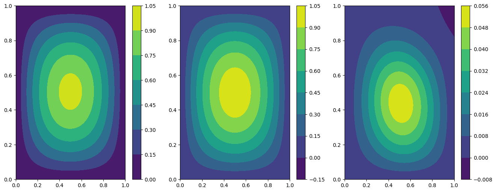

Tutorial 3: resolution of wave equation with custom Network
===========================================================

The problem solution
~~~~~~~~~~~~~~~~~~~~

In this tutorial we present how to solve the wave equation using the
``SpatialProblem`` and ``TimeDependentProblem`` class, and the
``Network`` class for building custom **torch** networks.

The problem is written in the following form:

:raw-latex:`\begin{equation}
\begin{cases}
\Delta u(x,y,t) = \frac{\partial^2}{\partial t^2} u(x,y,t) \quad \text{in } D, \\\\
u(x, y, t=0) = \sin(\pi x)\sin(\pi y)\cos(\sqrt{2}\pi), \\\\
u(x, y, t) = 0 \quad \text{on } \Gamma_1 \cup \Gamma_2 \cup \Gamma_3 \cup \Gamma_4,
\end{cases}
\end{equation}`

where :math:`D` is a square domain :math:`[0,1]^2`, and
:math:`\Gamma_i`, with :math:`i=1,...,4`, are the boundaries of the
square, and the velocity in the standard wave equation is fixed to one.

First of all, some useful imports.

.. code:: ipython3

    import torch
    
    from pina.problem import SpatialProblem, TimeDependentProblem
    from pina.operators import nabla, grad
    from pina.model import Network
    from pina import Condition, Span, PINN, Plotter

Now, the wave problem is written in PINA code as a class, inheriting
from ``SpatialProblem`` and ``TimeDependentProblem`` since we deal with
spatial, and time dependent variables. The equations are written as
``conditions`` that should be satisfied in the corresponding domains.
``truth_solution`` is the exact solution which will be compared with the
predicted one.

.. code:: ipython3

    class Wave(TimeDependentProblem, SpatialProblem):
        output_variables = ['u']
        spatial_domain = Span({'x': [0, 1], 'y': [0, 1]})
        temporal_domain = Span({'t': [0, 1]})
    
        def wave_equation(input_, output_):
            u_t = grad(output_, input_, components=['u'], d=['t'])
            u_tt = grad(u_t, input_, components=['dudt'], d=['t'])
            nabla_u = nabla(output_, input_, components=['u'], d=['x', 'y'])
            return nabla_u - u_tt
    
        def nil_dirichlet(input_, output_):
            value = 0.0
            return output_.extract(['u']) - value
        
        def initial_condition(input_, output_):
            u_expected = (torch.sin(torch.pi*input_.extract(['x'])) *
                          torch.sin(torch.pi*input_.extract(['y'])) *
                          torch.cos(torch.sqrt(torch.tensor(2.))))
            return output_.extract(['u']) - u_expected
    
        conditions = {
            'gamma1': Condition(Span({'x': [0, 1], 'y':  1, 't': [0, 1]}), nil_dirichlet),
            'gamma2': Condition(Span({'x': [0, 1], 'y': 0, 't': [0, 1]}), nil_dirichlet),
            'gamma3': Condition(Span({'x':  1, 'y': [0, 1], 't': [0, 1]}), nil_dirichlet),
            'gamma4': Condition(Span({'x': 0, 'y': [0, 1], 't': [0, 1]}), nil_dirichlet),
            't0': Condition(Span({'x': [0, 1], 'y': [0, 1], 't': 0}), initial_condition),
            'D': Condition(Span({'x': [0, 1], 'y': [0, 1], 't': [0, 1]}), wave_equation),
        }
    
        def wave_sol(self, pts):
            return (torch.sin(torch.pi*pts.extract(['x'])) *
                    torch.sin(torch.pi*pts.extract(['y'])) *
                    torch.cos(torch.sqrt(torch.tensor(2.))*torch.pi*pts.extract(['t'])))
        
        truth_solution = wave_sol
    
    # defining the problem
    problem = Wave()

After the problem, a **torch** model is needed to solve the PINN. With
the ``Network`` class the users can convert any **torch** model in a
**PINA** model which uses label tensors with a single line of code. We
will write a simple residual network using linear layers. Here we
implement a simple residual network composed by linear torch layers.

This neural network takes as input the coordinates (in this case
:math:`x`, :math:`y` and :math:`t`) and provides the unkwown field of
the Wave problem. The residual of the equations are evaluated at several
sampling points (which the user can manipulate using the method
``span_pts``) and the loss minimized by the neural network is the sum of
the residuals.

.. code:: ipython3

    class TorchNet(torch.nn.Module):
        
        def __init__(self):
            super().__init__()
            
            self.residual = torch.nn.Sequential(torch.nn.Linear(3, 16),
                                                torch.nn.Tanh(),
                                                torch.nn.Linear(16, 3),
                                                torch.nn.Tanh())
            
            self.mlp = torch.nn.Sequential(torch.nn.Linear(3, 24),
                                           torch.nn.Tanh(),
                                            torch.nn.Linear(24, 1))
        def forward(self, x):
            residual_x = self.residual(x)
            return self.mlp(x+residual_x)
        
    model = Network(model=TorchNet(),
                    input_variables=problem.input_variables, 
                    output_variables=problem.output_variables)

In this tutorial, the neural network is trained for 1500 epochs with a
learning rate of 0.008. These parameters can be modified as desired. We
highlight that the generation of the sampling points and the train is
here encapsulated within the function ``generate_samples_and_train``,
but only for saving some lines of code in the next cells; that function
is not mandatory in the **PINA** framework.

.. code:: ipython3

    def generate_samples_and_train(model, problem):
        pinn = PINN(problem, model, lr=0.008)
        pinn.span_pts(15, 'grid', locations=['D'])
        pinn.span_pts(20, 'grid', locations=['gamma1', 'gamma2', 'gamma3', 'gamma4'])
        pinn.span_pts(80, 'grid', locations=['t0'])
        pinn.train(1500, 250)
        return pinn
    
    
    pinn = generate_samples_and_train(model, problem)

.. parsed-literal::

                  sum          gamma1nil_di gamma2nil_di gamma3nil_di gamma4nil_di t0initial_co Dwave_equati 
    [epoch 00000] 1.949634e-01 3.005680e-02 6.441724e-02 3.294255e-02 6.325603e-02 3.027226e-03 1.263581e-03 
                  sum          gamma1nil_di gamma2nil_di gamma3nil_di gamma4nil_di t0initial_co Dwave_equati 
    [epoch 00001] 7.217254e-02 6.137958e-03 1.786630e-02 6.951613e-03 1.774752e-02 2.276723e-02 7.019176e-04 
                  sum          gamma1nil_di gamma2nil_di gamma3nil_di gamma4nil_di t0initial_co Dwave_equati 
    [epoch 00250] 4.112188e-03 2.494386e-04 1.979993e-04 2.449287e-04 2.625131e-04 3.139852e-03 1.745588e-05 
                  sum          gamma1nil_di gamma2nil_di gamma3nil_di gamma4nil_di t0initial_co Dwave_equati 
    [epoch 00500] 4.039850e-03 2.451004e-04 2.015663e-04 2.523335e-04 2.407064e-04 3.083990e-03 1.615283e-05 
                  sum          gamma1nil_di gamma2nil_di gamma3nil_di gamma4nil_di t0initial_co Dwave_equati 
    [epoch 00750] 3.942152e-03 2.204387e-04 2.094181e-04 2.657159e-04 2.246564e-04 2.996444e-03 2.547864e-05 
                  sum          gamma1nil_di gamma2nil_di gamma3nil_di gamma4nil_di t0initial_co Dwave_equati 
    [epoch 01000] 3.697490e-03 1.549838e-04 2.196791e-04 3.028835e-04 2.695825e-04 2.719009e-03 3.135128e-05 
                  sum          gamma1nil_di gamma2nil_di gamma3nil_di gamma4nil_di t0initial_co Dwave_equati 
    [epoch 01250] 3.240117e-03 1.137412e-04 1.829536e-04 3.278378e-04 3.354096e-04 2.235723e-03 4.445175e-05 
    [epoch 01500] 2.537301e-03 1.627188e-04 2.738914e-04 2.418139e-04 2.438446e-04 1.509327e-03 1.057045e-04 

After the training is completed one can now plot some results using the
``Plotter`` class of **PINA**.

.. code:: ipython3

    plotter = Plotter()
    
    # plotting at fixed time t = 0.5
    plotter.plot(pinn, fixed_variables={'t' : 0.5})

.. image:: tutorial_files/tutorial_12_0.png

We can also plot the pinn loss during the training to see the decrease.

.. code:: ipython3

    import matplotlib.pyplot as plt
    
    plt.figure(figsize=(16, 6))
    plotter.plot_loss(pinn, label='Loss')
    
    plt.grid()
    plt.legend()
    plt.show()

