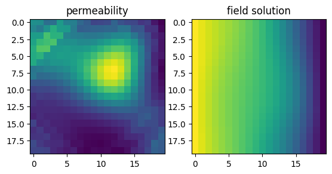

Tutorial 5: Fourier Neural Operator Learning
============================================

In this tutorial we are going to solve the Darcy flow 2d problem,
presented in `Fourier Neural Operator for Parametric Partial
Differential Equation <https://openreview.net/pdf?id=c8P9NQVtmnO>`__.
First of all we import the modules needed for the tutorial. Importing
``scipy`` is needed for input output operation, run
``pip install scipy`` for installing it.

.. code:: ipython3

    
    from scipy import io
    import torch
    from pina.model import FNO, FeedForward  # let's import some models
    from pina import Condition
    from pina import LabelTensor
    from pina.solvers import SupervisedSolver
    from pina.trainer import Trainer
    from pina.problem import AbstractProblem
    import matplotlib.pyplot as plt

Data Generation
---------------

We will focus on solving the a specfic PDE, the **Darcy Flow** equation.
The Darcy PDE is a second order, elliptic PDE with the following form:

.. math::

   -\nabla\cdot(k(x, y)\nabla u(x, y)) = f(x) \quad (x, y) \in D.

Specifically, :math:`u` is the flow pressure, :math:`k` is the
permeability field and :math:`f` is the forcing function. The Darcy flow
can parameterize a variety of systems including flow through porous
media, elastic materials and heat conduction. Here you will define the
domain as a 2D unit square Dirichlet boundary conditions. The dataset is
taken from the authors original reference.

.. code:: ipython3

    # download the dataset
    data = io.loadmat("Data_Darcy.mat")
    
    # extract data
    k_train = torch.tensor(data['k_train'], dtype=torch.float).unsqueeze(-1)
    u_train = torch.tensor(data['u_train'], dtype=torch.float).unsqueeze(-1)
    k_test = torch.tensor(data['k_test'], dtype=torch.float).unsqueeze(-1)
    u_test= torch.tensor(data['u_test'], dtype=torch.float).unsqueeze(-1)
    x = torch.tensor(data['x'], dtype=torch.float)[0]
    y = torch.tensor(data['y'], dtype=torch.float)[0]

Let’s visualize some data

.. code:: ipython3

    plt.subplot(1, 2, 1)
    plt.title('permeability')
    plt.imshow(k_train.squeeze(-1)[0])
    plt.subplot(1, 2, 2)
    plt.title('field solution')
    plt.imshow(u_train.squeeze(-1)[0])
    plt.show()

We now create the neural operator class. It is a very simple class,
inheriting from ``AbstractProblem``.

.. code:: ipython3

    class NeuralOperatorSolver(AbstractProblem):
        input_variables = ['u_0']
        output_variables = ['u']
        conditions = {'data' : Condition(input_points=LabelTensor(k_train, input_variables), 
                                         output_points=LabelTensor(u_train, input_variables))}
    
    # make problem
    problem = NeuralOperatorSolver()

Solving the problem with a FeedForward Neural Network
-----------------------------------------------------

We will first solve the problem using a Feedforward neural network. We
will use the ``SupervisedSolver`` for solving the problem, since we are
training using supervised learning.

.. code:: ipython3

    # make model
    model=FeedForward(input_dimensions=1, output_dimensions=1)
    
    
    # make solver
    solver = SupervisedSolver(problem=problem, model=model)
    
    # make the trainer and train
    trainer = Trainer(solver=solver, max_epochs=100)
    trainer.train()

.. parsed-literal::

    GPU available: False, used: False
    TPU available: False, using: 0 TPU cores
    IPU available: False, using: 0 IPUs
    HPU available: False, using: 0 HPUs
    
      | Name        | Type    | Params
    ----------------------------------------
    0 | _loss       | MSELoss | 0     
    1 | _neural_net | Network | 481   
    ----------------------------------------
    481       Trainable params
    0         Non-trainable params
    481       Total params
    0.002     Total estimated model params size (MB)

.. parsed-literal::

    Epoch 99: : 1it [00:00, 15.95it/s, v_num=85, mean_loss=0.105]

.. parsed-literal::

    `Trainer.fit` stopped: `max_epochs=100` reached.

.. parsed-literal::

    Epoch 99: : 1it [00:00, 15.53it/s, v_num=85, mean_loss=0.105]

The final loss is pretty high… We can calculate the error by importing
``LpLoss``.

.. code:: ipython3

    from pina.loss import LpLoss
    
    # make the metric
    metric_err = LpLoss(relative=True)
    
    
    err = float(metric_err(u_train.squeeze(-1), solver.models[0](k_train).squeeze(-1)).mean())*100
    print(f'Final error training {err:.2f}%')
    
    err = float(metric_err(u_test.squeeze(-1), solver.models[0](k_test).squeeze(-1)).mean())*100
    print(f'Final error testing {err:.2f}%')

.. parsed-literal::

    Final error training 56.06%
    Final error testing 55.95%

Solving the problem with a Fuorier Neural Operator (FNO)
--------------------------------------------------------

We will now move to solve the problem using a FNO. Since we are learning
operator this approach is better suited, as we shall see.

.. code:: ipython3

    # make model
    lifting_net = torch.nn.Linear(1, 24)
    projecting_net = torch.nn.Linear(24, 1)
    model = FNO(lifting_net=lifting_net,
                projecting_net=projecting_net,
                n_modes=16,
                dimensions=2,
                inner_size=24,
                padding=11)
    
    
    # make solver
    solver = SupervisedSolver(problem=problem, model=model)
    
    # make the trainer and train
    trainer = Trainer(solver=solver, max_epochs=20)
    trainer.train()

.. parsed-literal::

    GPU available: False, used: False
    TPU available: False, using: 0 TPU cores
    IPU available: False, using: 0 IPUs
    HPU available: False, using: 0 HPUs
    
      | Name        | Type    | Params
    ----------------------------------------
    0 | _loss       | MSELoss | 0     
    1 | _neural_net | Network | 591 K 
    ----------------------------------------
    591 K     Trainable params
    0         Non-trainable params
    591 K     Total params
    2.364     Total estimated model params size (MB)

.. parsed-literal::

    Epoch 19: : 1it [00:02,  2.65s/it, v_num=84, mean_loss=0.0294]

.. parsed-literal::

    `Trainer.fit` stopped: `max_epochs=20` reached.

.. parsed-literal::

    Epoch 19: : 1it [00:02,  2.67s/it, v_num=84, mean_loss=0.0294]

We can clearly see that with 1/3 of the total epochs the loss is lower.
Let’s see in testing.. Notice that the number of parameters is way
higher than a ``FeedForward`` network. We suggest to use GPU or TPU for
a speed up in training.

.. code:: ipython3

    err = float(metric_err(u_train.squeeze(-1), solver.models[0](k_train).squeeze(-1)).mean())*100
    print(f'Final error training {err:.2f}%')
    
    err = float(metric_err(u_test.squeeze(-1), solver.models[0](k_test).squeeze(-1)).mean())*100
    print(f'Final error testing {err:.2f}%')

.. parsed-literal::

    Final error training 26.05%
    Final error testing 25.58%

As we can see the loss is way lower!

What’s next?
------------

We have made a very simple example on how to use the ``FNO`` for
learning neural operator. Currently in **PINA** we implement 1D/2D/3D
cases. We suggest to extend the tutorial using more complex problems and
train for longer, to see the full potential of neural operators.
