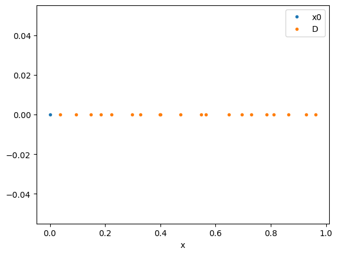
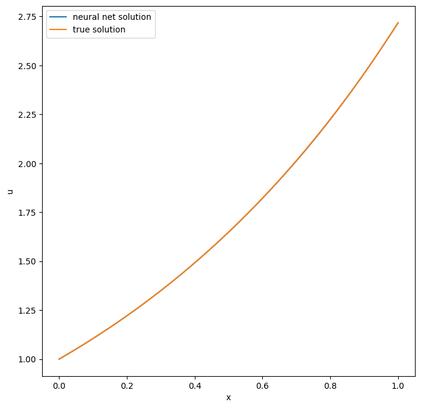
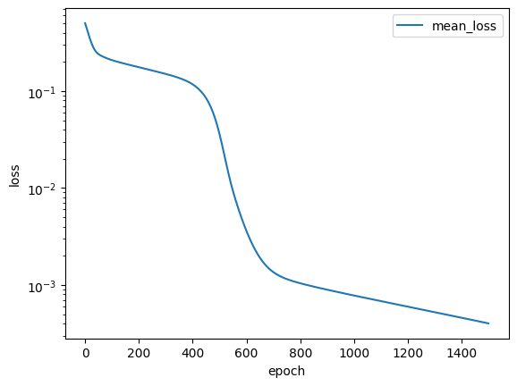

Tutorial: Physics Informed Neural Networks on PINA
==================================================

In this tutorial, we will demonstrate a typical use case of **PINA** on
a toy problem, following the standard API procedure.

.. raw:: html

   

.. raw:: html

   

Specifically, the tutorial aims to introduce the following topics:

-  Explaining how to build **PINA** Problem,
-  Showing how to generate data for ``PINN`` straining

These are the two main steps needed **before** starting the modelling
optimization (choose model and solver, and train). We will show each
step in detail, and at the end, we will solve a simple Ordinary
Differential Equation (ODE) problem busing the ``PINN`` solver.

Build a PINA problem
--------------------

Problem definition in the **PINA** framework is done by building a
python ``class``, which inherits from one or more problem classes
(``SpatialProblem``, ``TimeDependentProblem``, ``ParametricProblem``, …)
depending on the nature of the problem. Below is an example: ### Simple
Ordinary Differential Equation Consider the following:

.. math::

   \begin{equation}
   \begin{cases}
   \frac{d}{dx}u(x) &=  u(x) \quad x\in(0,1)\\
   u(x=0) &= 1 \\
   \end{cases}
   \end{equation}

with the analytical solution :math:`u(x) = e^x`. In this case, our ODE
depends only on the spatial variable :math:`x\in(0,1)` , meaning that
our ``Problem`` class is going to be inherited from the
``SpatialProblem`` class:

.. code:: python

   from pina.problem import SpatialProblem
   from pina import CartesianProblem

   class SimpleODE(SpatialProblem):
       
       output_variables = ['u']
       spatial_domain = CartesianProblem({'x': [0, 1]})

       # other stuff ...

Notice that we define ``output_variables`` as a list of symbols,
indicating the output variables of our equation (in this case only
:math:`u`), this is done because in **PINA** the ``torch.Tensor``\ s are
labelled, allowing the user maximal flexibility for the manipulation of
the tensor. The ``spatial_domain`` variable indicates where the sample
points are going to be sampled in the domain, in this case
:math:`x\in[0,1]`.

What about if our equation is also time dependent? In this case, our
``class`` will inherit from both ``SpatialProblem`` and
``TimeDependentProblem``:

.. code:: ipython3

    from pina.problem import SpatialProblem, TimeDependentProblem
    from pina import CartesianDomain
    
    class TimeSpaceODE(SpatialProblem, TimeDependentProblem):
        
        output_variables = ['u']
        spatial_domain = CartesianDomain({'x': [0, 1]})
        temporal_domain = CartesianDomain({'t': [0, 1]})
    
        # other stuff ...

where we have included the ``temporal_domain`` variable, indicating the
time domain wanted for the solution.

In summary, using **PINA**, we can initialize a problem with a class
which inherits from different base classes: ``SpatialProblem``,
``TimeDependentProblem``, ``ParametricProblem``, and so on depending on
the type of problem we are considering. Here are some examples (more on
the official documentation): \* ``SpatialProblem`` :math:`\rightarrow` a
differential equation with spatial variable(s) \*
``TimeDependentProblem`` :math:`\rightarrow` a time-dependent
differential equation \* ``ParametricProblem`` :math:`\rightarrow` a
parametrized differential equation \* ``AbstractProblem``
:math:`\rightarrow` any **PINA** problem inherits from here

Write the problem class
~~~~~~~~~~~~~~~~~~~~~~~

Once the ``Problem`` class is initialized, we need to represent the
differential equation in **PINA**. In order to do this, we need to load
the **PINA** operators from ``pina.operators`` module. Again, we’ll
consider Equation (1) and represent it in **PINA**:

.. code:: ipython3

    from pina.problem import SpatialProblem
    from pina.operators import grad
    from pina import Condition
    from pina.geometry import CartesianDomain
    from pina.equation import Equation, FixedValue
    
    import torch
    
    
    class SimpleODE(SpatialProblem):
    
        output_variables = ['u']
        spatial_domain = CartesianDomain({'x': [0, 1]})
    
        # defining the ode equation
        def ode_equation(input_, output_):
    
            # computing the derivative
            u_x = grad(output_, input_, components=['u'], d=['x'])
    
            # extracting the u input variable
            u = output_.extract(['u'])
    
            # calculate the residual and return it
            return u_x - u
    
        # conditions to hold
        conditions = {
            'x0': Condition(location=CartesianDomain({'x': 0.}), equation=FixedValue(1)),             # We fix initial condition to value 1
            'D': Condition(location=CartesianDomain({'x': [0, 1]}), equation=Equation(ode_equation)), # We wrap the python equation using Equation
        }
    
        # sampled points (see below)
        input_pts = None
    
        # defining the true solution
        def truth_solution(self, pts):
            return torch.exp(pts.extract(['x']))
        
    problem = SimpleODE()

After we define the ``Problem`` class, we need to write different class
methods, where each method is a function returning a residual. These
functions are the ones minimized during PINN optimization, given the
initial conditions. For example, in the domain :math:`[0,1]`, the ODE
equation (``ode_equation``) must be satisfied. We represent this by
returning the difference between subtracting the variable ``u`` from its
gradient (the residual), which we hope to minimize to 0. This is done
for all conditions. Notice that we do not pass directly a ``python``
function, but an ``Equation`` object, which is initialized with the
``python`` function. This is done so that all the computations, and
internal checks are done inside **PINA**.

Once we have defined the function, we need to tell the neural network
where these methods are to be applied. To do so, we use the
``Condition`` class. In the ``Condition`` class, we pass the location
points and the equation we want minimized on those points (other
possibilities are allowed, see the documentation for reference).

Finally, it’s possible to define a ``truth_solution`` function, which
can be useful if we want to plot the results and see how the real
solution compares to the expected (true) solution. Notice that the
``truth_solution`` function is a method of the ``PINN`` class, but is
not mandatory for problem definition.

Generate data
-------------

Data for training can come in form of direct numerical simulation
reusults, or points in the domains. In case we do unsupervised learning,
we just need the collocation points for training, i.e. points where we
want to evaluate the neural network. Sampling point in **PINA** is very
easy, here we show three examples using the ``.discretise_domain``
method of the ``AbstractProblem`` class.

.. code:: ipython3

    # sampling 20 points in [0, 1] through discretization in all locations
    problem.discretise_domain(n=20, mode='grid', variables=['x'], locations='all')
    
    # sampling 20 points in (0, 1) through latin hypercube samping in D, and 1 point in x0
    problem.discretise_domain(n=20, mode='latin', variables=['x'], locations=['D'])
    problem.discretise_domain(n=1, mode='random', variables=['x'], locations=['x0'])
    
    # sampling 20 points in (0, 1) randomly
    problem.discretise_domain(n=20, mode='random', variables=['x'])

We are going to use latin hypercube points for sampling. We need to
sample in all the conditions domains. In our case we sample in ``D`` and
``x0``.

.. code:: ipython3

    # sampling for training
    problem.discretise_domain(1, 'random', locations=['x0'])
    problem.discretise_domain(20, 'lh', locations=['D'])

The points are saved in a python ``dict``, and can be accessed by
calling the attribute ``input_pts`` of the problem

.. code:: ipython3

    print('Input points:', problem.input_pts)
    print('Input points labels:', problem.input_pts['D'].labels)

.. parsed-literal::

    Input points: {'x0': LabelTensor([[[0.]]]), 'D': LabelTensor([[[0.8633]],
                 [[0.4009]],
                 [[0.6489]],
                 [[0.9278]],
                 [[0.3975]],
                 [[0.1484]],
                 [[0.9632]],
                 [[0.5485]],
                 [[0.2984]],
                 [[0.5643]],
                 [[0.0368]],
                 [[0.7847]],
                 [[0.4741]],
                 [[0.6957]],
                 [[0.3281]],
                 [[0.0958]],
                 [[0.1847]],
                 [[0.2232]],
                 [[0.8099]],
                 [[0.7304]]])}
    Input points labels: ['x']

To visualize the sampled points we can use the ``.plot_samples`` method
of the ``Plotter`` class

.. code:: ipython3

    from pina import Plotter
    
    pl = Plotter()
    pl.plot_samples(problem=problem)

Perform a small training
------------------------

Once we have defined the problem and generated the data we can start the
modelling. Here we will choose a ``FeedForward`` neural network
available in ``pina.model``, and we will train using the ``PINN`` solver
from ``pina.solvers``. We highlight that this training is fairly simple,
for more advanced stuff consider the tutorials in the **Physics Informed
Neural Networks** section of **Tutorials**. For training we use the
``Trainer`` class from ``pina.trainer``. Here we show a very short
training and some method for plotting the results. Notice that by
default all relevant metrics (e.g. MSE error during training) are going
to be tracked using a ``lightining`` logger, by default ``CSVLogger``.
If you want to track the metric by yourself without a logger, use
``pina.callbacks.MetricTracker``.

.. code:: ipython3

    from pina import PINN, Trainer
    from pina.model import FeedForward
    from pina.callbacks import MetricTracker
    
    
    # build the model
    model = FeedForward(
        layers=[10, 10],
        func=torch.nn.Tanh,
        output_dimensions=len(problem.output_variables),
        input_dimensions=len(problem.input_variables)
    )
    
    # create the PINN object
    pinn = PINN(problem, model)
    
    # create the trainer
    trainer = Trainer(solver=pinn, max_epochs=1500, callbacks=[MetricTracker()], accelerator='cpu', enable_model_summary=False) # we train on CPU and avoid model summary at beginning of training (optional)
    
    # train
    trainer.train()

.. parsed-literal::

    GPU available: False, used: False
    TPU available: False, using: 0 TPU cores
    IPU available: False, using: 0 IPUs
    HPU available: False, using: 0 HPUs
    Missing logger folder: /Users/dariocoscia/Desktop/PINA/tutorials/tutorial1/lightning_logs

.. parsed-literal::

    Epoch 1499: : 1it [00:00, 316.24it/s, v_num=0, mean_loss=5.39e-5, x0_loss=1.26e-6, D_loss=0.000106] 

.. parsed-literal::

    `Trainer.fit` stopped: `max_epochs=1500` reached.

.. parsed-literal::

    Epoch 1499: : 1it [00:00, 166.89it/s, v_num=0, mean_loss=5.39e-5, x0_loss=1.26e-6, D_loss=0.000106]

After the training we can inspect trainer logged metrics (by default
**PINA** logs mean square error residual loss). The logged metrics can
be accessed online using one of the ``Lightinig`` loggers. The final
loss can be accessed by ``trainer.logged_metrics``

.. code:: ipython3

    # inspecting final loss
    trainer.logged_metrics

.. parsed-literal::

    {'mean_loss': tensor(5.3852e-05),
     'x0_loss': tensor(1.2636e-06),
     'D_loss': tensor(0.0001)}

By using the ``Plotter`` class from **PINA** we can also do some
quatitative plots of the solution.

.. code:: ipython3

    # plotting the solution
    pl.plot(solver=pinn)

.. parsed-literal::

    <Figure size 640x480 with 0 Axes>

The solution is overlapped with the actual one, and they are barely
indistinguishable. We can also plot easily the loss:

.. code:: ipython3

    pl.plot_loss(trainer=trainer, label = 'mean_loss',  logy=True)

As we can see the loss has not reached a minimum, suggesting that we
could train for longer

What’s next?
------------

Nice you have completed the introductory tutorial of **PINA**! There are
multiple directions you can go now:

1. Train the network for longer or with different layer sizes and assert
   the finaly accuracy

2. Train the network using other types of models (see ``pina.model``)

3. GPU trainining and benchmark the speed

4. Many more…
