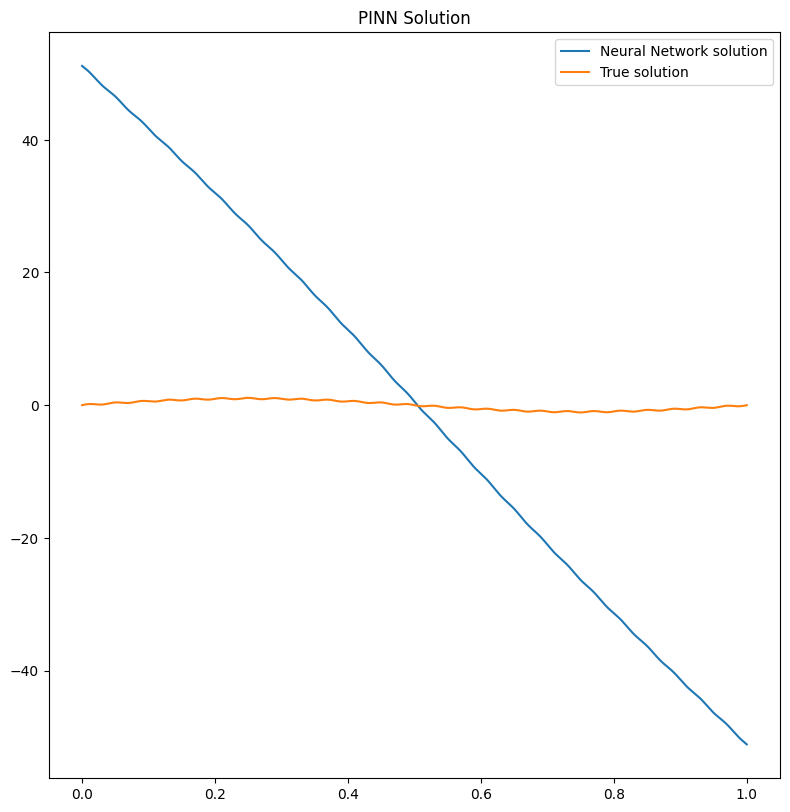
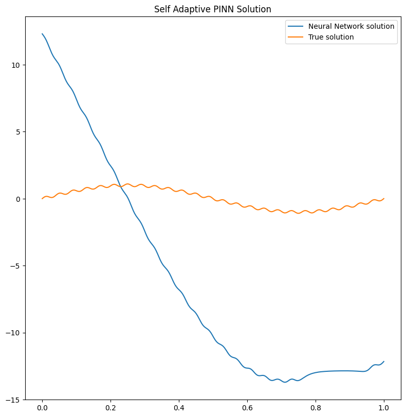
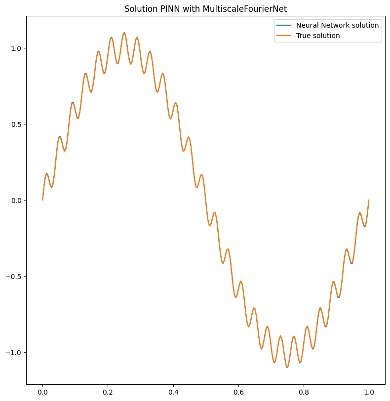

Tutorial: Multiscale PDE learning with Fourier Feature Network
==============================================================

|Open In Colab|

.. |Open In Colab| image:: https://colab.research.google.com/assets/colab-badge.svg
   :target: https://colab.research.google.com/github/mathLab/PINA/blob/master/tutorials/tutorial13/tutorial.ipynb

This tutorial presents how to solve with Physics-Informed Neural
Networks (PINNs) a PDE characterized by multiscale behaviour, as
presented in `On the eigenvector bias of Fourier feature networks: From
regression to solving multi-scale PDEs with physics-informed neural
networks <https://doi.org/10.1016/j.cma.2021.113938>`__.

First of all, some useful imports.

.. code:: ipython3

    ## routine needed to run the notebook on Google Colab
    try:
      import google.colab
      IN_COLAB = True
    except:
      IN_COLAB = False
    if IN_COLAB:
      !pip install "pina-mathlab"
    
    import torch
    
    from pina import Condition, Plotter, Trainer, Plotter
    from pina.problem import SpatialProblem
    from pina.operators import laplacian
    from pina.solvers import PINN, SAPINN
    from pina.model.layers import FourierFeatureEmbedding
    from pina.loss import LpLoss
    from pina.geometry import CartesianDomain
    from pina.equation import Equation, FixedValue
    from pina.model import FeedForward


Multiscale Problem
------------------

We begin by presenting the problem which also can be found in Section 2
of `On the eigenvector bias of Fourier feature networks: From regression
to solving multi-scale PDEs with physics-informed neural
networks <https://doi.org/10.1016/j.cma.2021.113938>`__. The
one-dimensional Poisson problem we aim to solve is mathematically
written as:

.. math::

    \begin{equation}
    \begin{cases}
    \Delta u (x) + f(x) = 0 \quad x \in [0,1], \\
    u(x) = 0 \quad x \in \partial[0,1], \\
    \end{cases}
    \end{equation}

We impose the solution as
:math:`u(x) = \sin(2\pi x) + 0.1 \sin(50\pi x)` and obtain the force
term
:math:`f(x) = (2\pi)^2 \sin(2\pi x) + 0.1 (50 \pi)^2 \sin(50\pi x)`.
Though this example is simple and pedagogical, it is worth noting that
the solution exhibits low frequency in the macro-scale and high
frequency in the micro-scale, which resembles many practical scenarios.

In **PINA** this problem is written, as always, as a class `see here for
a tutorial on the Problem
class <https://mathlab.github.io/PINA/_rst/tutorials/tutorial1/tutorial.html>`__.
Below you can find the ``Poisson`` problem which is mathmatically
described above.

.. code:: ipython3

    class Poisson(SpatialProblem):
        output_variables = ['u']
        spatial_domain = CartesianDomain({'x': [0, 1]})
    
        def poisson_equation(input_, output_):
            x = input_.extract('x')
            u_xx = laplacian(output_, input_, components=['u'], d=['x'])
            f = ((2*torch.pi)**2)*torch.sin(2*torch.pi*x) + 0.1*((50*torch.pi)**2)*torch.sin(50*torch.pi*x)
            return u_xx + f
    
        # here we write the problem conditions
        conditions = {
            'gamma0' : Condition(location=CartesianDomain({'x': 0}),
                                 equation=FixedValue(0)),
            'gamma1' : Condition(location=CartesianDomain({'x': 1}),
                                 equation=FixedValue(0)),
            'D':       Condition(location=spatial_domain,
                                 equation=Equation(poisson_equation)),
        }
    
        def truth_solution(self, x):
            return torch.sin(2*torch.pi*x) + 0.1*torch.sin(50*torch.pi*x)
    
    problem = Poisson()
    
    # let's discretise the domain
    problem.discretise_domain(128, 'grid')

A standard PINN approach would be to fit this model using a Feed Forward
(fully connected) Neural Network. For a conventional fully-connected
neural network is easy to approximate a function :math:`u`, given
sufficient data inside the computational domain. However solving
high-frequency or multi-scale problems presents great challenges to
PINNs especially when the number of data cannot capture the different
scales.

Below we run a simulation using the ``PINN`` solver and the self
adaptive ``SAPINN`` solver, using a
``FeedForward`` model. We used a ``MultiStepLR`` scheduler to decrease the learning rate
slowly during training (it takes around 2 minutes to run on CPU).

.. code:: ipython3

    # training with PINN and visualize results
    pinn = PINN(problem=problem,
                model=FeedForward(input_dimensions=1, output_dimensions=1, layers=[100, 100, 100]),
                scheduler=torch.optim.lr_scheduler.MultiStepLR,
                scheduler_kwargs={'milestones' : [1000, 2000, 3000, 4000], 'gamma':0.9})
    trainer = Trainer(pinn, max_epochs=5000, accelerator='cpu', enable_model_summary=False)
    trainer.train()
    
    # training with PINN and visualize results
    sapinn = SAPINN(problem=problem,
                    model=FeedForward(input_dimensions=1, output_dimensions=1, layers=[100, 100, 100]),
                    scheduler_model=torch.optim.lr_scheduler.MultiStepLR,
                    scheduler_model_kwargs={'milestones' : [1000, 2000, 3000, 4000], 'gamma':0.9})
    trainer_sapinn = Trainer(sapinn, max_epochs=5000, accelerator='cpu', enable_model_summary=False)
    trainer_sapinn.train()
    
    # plot results
    pl = Plotter()
    pl.plot(pinn, title='PINN Solution')
    pl.plot(sapinn, title='Self Adaptive PINN Solution')


.. parsed-literal::

    GPU available: True (mps), used: False
    TPU available: False, using: 0 TPU cores
    IPU available: False, using: 0 IPUs
    HPU available: False, using: 0 HPUs
    Epoch 4999: 100%|██████████| 1/1 [00:00<00:00, 97.66it/s, v_num=69, gamma0_loss=2.61e+3, gamma1_loss=2.61e+3, D_loss=409.0, mean_loss=1.88e+3] 


.. parsed-literal::

    GPU available: True (mps), used: False
    TPU available: False, using: 0 TPU cores
    IPU available: False, using: 0 IPUs
    HPU available: False, using: 0 HPUs
    Epoch 4999: 100%|██████████| 1/1 [00:00<00:00, 65.77it/s, v_num=70, gamma0_loss=151.0, gamma1_loss=148.0, D_loss=6.38e+5, mean_loss=2.13e+5]








We can clearly see that the solution has not been learned by the two
different solvers. Indeed the big problem is not in the optimization
strategy (i.e. the solver), but in the model used to solve the problem.
A simple ``FeedForward`` network can hardly handle multiscales if not
enough collocation points are used!

We can also compute the :math:`l_2` relative error for the ``PINN`` and
``SAPINN`` solutions:

.. code:: ipython3

    # l2 loss from PINA losses
    l2_loss = LpLoss(p=2, relative=True)
    
    # sample new test points
    pts = pts = problem.spatial_domain.sample(100, 'grid')
    print(f'Relative l2 error PINN      {l2_loss(pinn(pts), problem.truth_solution(pts)).item():.2%}')
    print(f'Relative l2 error SAPINN    {l2_loss(sapinn(pts), problem.truth_solution(pts)).item():.2%}')


.. parsed-literal::

    Relative l2 error PINN      95.76%
    Relative l2 error SAPINN    124.26%


Which is indeed very high!

Fourier Feature Embedding in PINA
---------------------------------

Fourier Feature Embedding is a way to transform the input features, to
help the network in learning multiscale variations in the output. It was
first introduced in `On the eigenvector bias of Fourier feature
networks: From regression to solving multi-scale PDEs with
physics-informed neural
networks <https://doi.org/10.1016/j.cma.2021.113938>`__ showing great
results for multiscale problems. The basic idea is to map the input
:math:`\mathbf{x}` into an embedding :math:`\tilde{\mathbf{x}}` where:

.. math::  \tilde{\mathbf{x}} =\left[\cos\left( \mathbf{B} \mathbf{x} \right), \sin\left( \mathbf{B} \mathbf{x} \right)\right] 

and :math:`\mathbf{B}_{ij} \sim \mathcal{N}(0, \sigma^2)`. This simple
operation allow the network to learn on multiple scales!

In PINA we already have implemented the feature as a ``layer`` called
```FourierFeatureEmbedding`` <https://mathlab.github.io/PINA/_rst/layers/fourier_embedding.html>`__.
Below we will build the *Multi-scale Fourier Feature Architecture*. In
this architecture multiple Fourier feature embeddings (initialized with
different :math:`\sigma`) are applied to input coordinates and then
passed through the same fully-connected neural network, before the
outputs are finally concatenated with a linear layer.

.. code:: ipython3

    class MultiscaleFourierNet(torch.nn.Module):
        def __init__(self):
            super().__init__()
            self.embedding1 = FourierFeatureEmbedding(input_dimension=1, 
                                                      output_dimension=100,
                                                      sigma=1)
            self.embedding2 = FourierFeatureEmbedding(input_dimension=1, 
                                                      output_dimension=100,
                                                      sigma=10)
            self.layers = FeedForward(input_dimensions=100, output_dimensions=100, layers=[100])
            self.final_layer = torch.nn.Linear(2*100, 1)
    
        def forward(self, x):
            e1 = self.layers(self.embedding1(x))
            e2 = self.layers(self.embedding2(x))
            return self.final_layer(torch.cat([e1, e2], dim=-1))
    
    MultiscaleFourierNet()


.. parsed-literal::

    MultiscaleFourierNet(
      (embedding1): FourierFeatureEmbedding()
      (embedding2): FourierFeatureEmbedding()
      (layers): FeedForward(
        (model): Sequential(
          (0): Linear(in_features=100, out_features=100, bias=True)
          (1): Tanh()
          (2): Linear(in_features=100, out_features=100, bias=True)
        )
      )
      (final_layer): Linear(in_features=200, out_features=1, bias=True)
    )


We will train the ``MultiscaleFourierNet`` with the ``PINN`` solver (and
feel free to try also with our PINN variants (``SAPINN``, ``GPINN``,
``CompetitivePINN``, …).

.. code:: ipython3

    multiscale_pinn = PINN(problem=problem,
                           model=MultiscaleFourierNet(),
                           scheduler=torch.optim.lr_scheduler.MultiStepLR,
                           scheduler_kwargs={'milestones' : [1000, 2000, 3000, 4000], 'gamma':0.9})
    trainer = Trainer(multiscale_pinn, max_epochs=5000, accelerator='cpu', enable_model_summary=False) # we train on CPU and avoid model summary at beginning of training (optional)
    trainer.train()


.. parsed-literal::

    GPU available: True (mps), used: False
    TPU available: False, using: 0 TPU cores
    IPU available: False, using: 0 IPUs
    HPU available: False, using: 0 HPUs
    Epoch 4999: 100%|██████████| 1/1 [00:00<00:00, 72.21it/s, v_num=71, gamma0_loss=3.91e-5, gamma1_loss=3.91e-5, D_loss=0.000151, mean_loss=0.000113]


Let us now plot the solution and compute the relative :math:`l_2` again!

.. code:: ipython3

    # plot the solution
    pl.plot(multiscale_pinn, title='Solution PINN with MultiscaleFourierNet')
    
    # sample new test points
    pts = pts = problem.spatial_domain.sample(100, 'grid')
    print(f'Relative l2 error PINN with MultiscaleFourierNet      {l2_loss(multiscale_pinn(pts), problem.truth_solution(pts)).item():.2%}')





.. parsed-literal::

    Relative l2 error PINN with MultiscaleFourierNet      2.72%


It is pretty clear that the network has learned the correct solution,
with also a very law error. Obviously a longer training and a more
expressive neural network could improve the results!

What’s next?
------------

Congratulations on completing the one dimensional Poisson tutorial of
**PINA** using ``FourierFeatureEmbedding``! There are multiple
directions you can go now:

1. Train the network for longer or with different layer sizes and assert
   the finaly accuracy

2. Understand the role of ``sigma`` in ``FourierFeatureEmbedding`` (see
   original paper for a nice reference)

3. Code the *Spatio-temporal multi-scale Fourier feature architecture*
   for a more complex time dependent PDE (section 3 of the original
   reference)

4. Many more…
