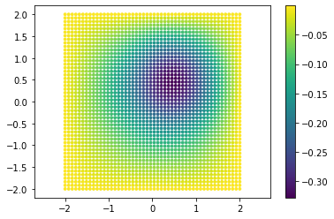
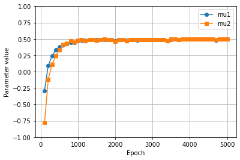

Tutorial 7: Resolution of an inverse problem
============================================

Introduction to the inverse problem
~~~~~~~~~~~~~~~~~~~~~~~~~~~~~~~~~~~

This tutorial shows how to solve an inverse Poisson problem with
Physics-Informed Neural Networks. The problem definition is that of a
Poisson problem with homogeneous boundary conditions and it reads:
:raw-latex:`\begin{equation}
\begin{cases}
\Delta u = e^{-2(x-\mu_1)^2-2(y-\mu_2)^2} \text{ in } \Omega\, ,\\
u = 0 \text{ on }\partial \Omega,\\
u(\mu_1, \mu_2) = \text{ data}
\end{cases}
\end{equation}` where :math:`\Omega` is a square domain
:math:`[-2, 2] \times [-2, 2]`, and
:math:`\partial \Omega=\Gamma_1 \cup \Gamma_2 \cup \Gamma_3 \cup \Gamma_4`
is the union of the boundaries of the domain.

This kind of problem, namely the “inverse problem”, has two main goals:
- find the solution :math:`u` that satisfies the Poisson equation; -
find the unknown parameters (:math:`\mu_1`, :math:`\mu_2`) that better
fit some given data (third equation in the system above).

In order to achieve both the goals we will need to define an
``InverseProblem`` in PINA.

Let’s start with useful imports.

.. code:: ipython3

    import matplotlib.pyplot as plt
    import torch
    from pytorch_lightning.callbacks import Callback
    from pina.problem import SpatialProblem, InverseProblem
    from pina.operators import laplacian
    from pina.model import FeedForward
    from pina.equation import Equation, FixedValue
    from pina import Condition, Trainer
    from pina.solvers import PINN
    from pina.geometry import CartesianDomain

Then, we import the pre-saved data, for (:math:`\mu_1`,
:math:`\mu_2`)=(:math:`0.5`, :math:`0.5`). These two values are the
optimal parameters that we want to find through the neural network
training. In particular, we import the ``input_points``\ (the spatial
coordinates), and the ``output_points`` (the corresponding :math:`u`
values evaluated at the ``input_points``).

.. code:: ipython3

    data_output = torch.load('data/pinn_solution_0.5_0.5').detach()
    data_input = torch.load('data/pts_0.5_0.5')

Moreover, let’s plot also the data points and the reference solution:
this is the expected output of the neural network.

.. code:: ipython3

    points = data_input.extract(['x', 'y']).detach().numpy()
    truth = data_output.detach().numpy()

    plt.scatter(points[:, 0], points[:, 1], c=truth, s=8)
    plt.axis('equal')
    plt.colorbar()
    plt.show()

Inverse problem definition in PINA
~~~~~~~~~~~~~~~~~~~~~~~~~~~~~~~~~~

Then, we initialize the Poisson problem, that is inherited from the
``SpatialProblem`` and from the ``InverseProblem`` classes. We here have
to define all the variables, and the domain where our unknown parameters
(:math:`\mu_1`, :math:`\mu_2`) belong. Notice that the laplace equation
takes as inputs also the unknown variables, that will be treated as
parameters that the neural network optimizes during the training
process.

.. code:: ipython3

    ### Define ranges of variables
    x_min = -2
    x_max = 2
    y_min = -2
    y_max = 2

    class Poisson(SpatialProblem, InverseProblem):
        '''
        Problem definition for the Poisson equation.
        '''
        output_variables = ['u']
        spatial_domain = CartesianDomain({'x': [x_min, x_max], 'y': [y_min, y_max]})
        # define the ranges for the parameters
        unknown_parameter_domain = CartesianDomain({'mu1': [-1, 1], 'mu2': [-1, 1]})

        def laplace_equation(input_, output_, params_):
            '''
            Laplace equation with a force term.
            '''
            force_term = torch.exp(
                    - 2*(input_.extract(['x']) - params_['mu1'])**2
                    - 2*(input_.extract(['y']) - params_['mu2'])**2)
            delta_u = laplacian(output_, input_, components=['u'], d=['x', 'y'])

            return delta_u - force_term

        # define the conditions for the loss (boundary conditions, equation, data)
        conditions = {
            'gamma1': Condition(location=CartesianDomain({'x': [x_min, x_max],
                'y':  y_max}),
                equation=FixedValue(0.0, components=['u'])),
            'gamma2': Condition(location=CartesianDomain({'x': [x_min, x_max], 'y': y_min
                }),
                equation=FixedValue(0.0, components=['u'])),
            'gamma3': Condition(location=CartesianDomain({'x':  x_max, 'y': [y_min, y_max]
                }),
                equation=FixedValue(0.0, components=['u'])),
            'gamma4': Condition(location=CartesianDomain({'x': x_min, 'y': [y_min, y_max]
                }),
                equation=FixedValue(0.0, components=['u'])),
            'D': Condition(location=CartesianDomain({'x': [x_min, x_max], 'y': [y_min, y_max]
                }),
            equation=Equation(laplace_equation)),
            'data': Condition(input_points=data_input.extract(['x', 'y']), output_points=data_output)
        }

    problem = Poisson()

Then, we define the model of the neural network we want to use. Here we
used a model which impose hard constrains on the boundary conditions, as
also done in the Wave tutorial!

.. code:: ipython3

    model = FeedForward(
        layers=[20, 20, 20],
        func=torch.nn.Softplus,
        output_dimensions=len(problem.output_variables),
        input_dimensions=len(problem.input_variables)
        )

After that, we discretize the spatial domain.

.. code:: ipython3

    problem.discretise_domain(20, 'grid', locations=['D'], variables=['x', 'y'])
    problem.discretise_domain(1000, 'random', locations=['gamma1', 'gamma2',
        'gamma3', 'gamma4'], variables=['x', 'y'])

Here, we define a simple callback for the trainer. We use this callback
to save the parameters predicted by the neural network during the
training. The parameters are saved every 100 epochs as ``torch`` tensors
in a specified directory (``tmp_dir`` in our case). The goal is to read
the saved parameters after training and plot their trend across the
epochs.

.. code:: ipython3

    # temporary directory for saving logs of training
    tmp_dir = "tmp_poisson_inverse"

    class SaveParameters(Callback):
        '''
        Callback to save the parameters of the model every 100 epochs.
        '''
        def on_train_epoch_end(self, trainer, __):
            if trainer.current_epoch % 100 == 99:
                torch.save(trainer.solver.problem.unknown_parameters, '{}/parameters_epoch{}'.format(tmp_dir, trainer.current_epoch))

Then, we define the ``PINN`` object and train the solver using the
``Trainer``.

.. code:: ipython3

    ### train the problem with PINN
    max_epochs = 5000
    pinn = PINN(problem, model, optimizer_kwargs={'lr':0.005})
    # define the trainer for the solver
    trainer = Trainer(solver=pinn, accelerator='cpu', max_epochs=max_epochs,
            default_root_dir=tmp_dir, callbacks=[SaveParameters()])
    trainer.train()

One can now see how the parameters vary during the training by reading
the saved solution and plotting them. The plot shows that the parameters
stabilize to their true value before reaching the epoch :math:`1000`!

.. code:: ipython3

    epochs_saved = range(99, max_epochs, 100)
    parameters = torch.empty((int(max_epochs/100), 2))
    for i, epoch in enumerate(epochs_saved):
        params_torch = torch.load('{}/parameters_epoch{}'.format(tmp_dir, epoch))
        for e, var in enumerate(pinn.problem.unknown_variables):
            parameters[i, e] = params_torch[var].data

    # Plot parameters
    plt.close()
    plt.plot(epochs_saved, parameters[:, 0], label='mu1', marker='o')
    plt.plot(epochs_saved, parameters[:, 1], label='mu2', marker='s')
    plt.ylim(-1, 1)
    plt.grid()
    plt.legend()
    plt.xlabel('Epoch')
    plt.ylabel('Parameter value')
    plt.show()

