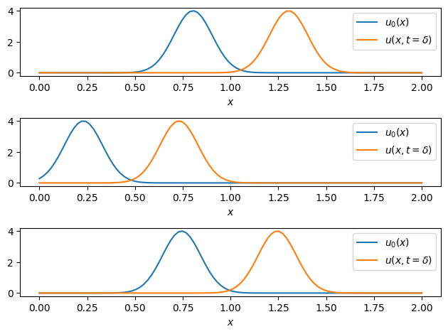
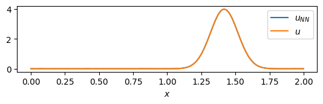
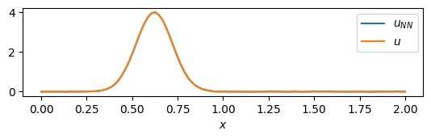
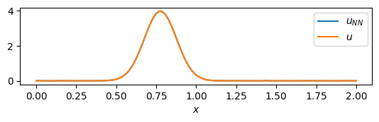
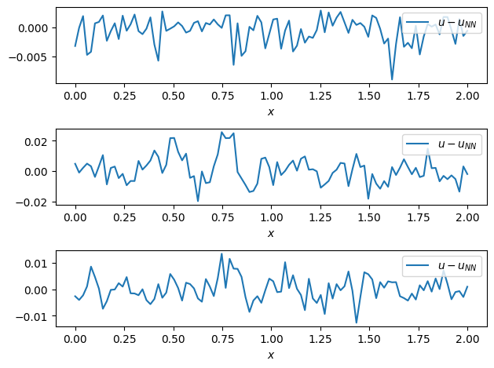

Tutorial: Advection Equation with data driven DeepONet neural operator
======================================================================

In this tutorial we will show how to solve the advection neural operator
problem using ``DeepONet``. Specifically, we will follow the original
formulation of Lu Lu, et al. in `DeepONet: Learning nonlinear operators
for identifying differential equations based on the universal
approximation theorem of operator <https://arxiv.org/abs/1910.03193>`__.

We import the relevant modules first.

.. code:: ipython3

    import matplotlib.pyplot as plt
    from pina import Trainer, Condition
    from pina.model import FeedForward, DeepONet
    from pina.solvers import SupervisedSolver
    from pina.problem import AbstractProblem
    from pina.loss import LpLoss
    import torch

The advection mathematical problem and data loading
---------------------------------------------------

Consider the one dimensional advection problem:

.. math::

   \frac{\partial u}{\partial t} + \frac{\partial u}{\partial x} = 0, \quad x\in[0,2], \;t\in[0,1]

with periodic boundary condition. We choose the initial condition as a
Gaussian wave centered in :math:`\mu` and of width
:math:`\sigma^2=0.02`. We choose :math:`\mu` to be distributed according
to a Uniform distribution in :math:`[0.05, 1]`. Hence the initial
condition is:

.. math::

   u_0(x) = \frac{1}{\sqrt{\pi\sigma^2}}e^{-\frac{(x - \mu)^2}{2\sigma^2}}, \quad \mu\sim U(0.05, 1), \; x\in[0,2].

The final objective is to learn the operator:

.. math:: \mathcal{G} : u_0(x) → u(x, t = \delta) = u_0(x - \delta)

where we set :math:`\delta=0.5` just for sake of the tutorial. Notice
that a general problem is to lear the operator mapping the initial
condition to a specific time instance. By fixing :math:`\delta` dataset
is composed of trajectories containing initial conditions as input, and
the same trajectories after :math:`\delta` time as output.

The input/output shape will be ``[T, Nx, D]``, where ``T`` is the number
of trajectories, ``Nx`` the discretization along the spatial dimension,
and ``D`` the dimension of the input. In this case ``D=1`` since the
input is the one dimensional field value ``u``. The data for training
are stored in ``advection_input_training.pt``,
``advection_output_training.pt``; while the one for testing in
``advection_input_testing.pt``, ``advection_output_testing.pt``. We
train on ``T=100`` trajectories, and test on ``T=1000``. Notice that the
discretization in the spatial dimension is fixed to ``Nx=100``.

We start by loading the data and perform some plotting.

.. code:: ipython3

    # loading training data
    data_0_training = torch.load('advection_input_training.pt')
    data_dt_training = torch.load('advection_output_training.pt')
    
    # loading testing data
    data_0_testing = torch.load('advection_input_testing.pt')
    data_dt_testing = torch.load('advection_output_testing.pt')

The data are loaded, let’s visualize a few of the initial conditions!

.. code:: ipython3

    # storing the discretization in space:
    Nx = data_0_training.shape[1]
    
    for idx, i in enumerate(torch.randint(0, data_0_training.shape[0], (3,))):
        u0 = data_0_training[i].extract('ui')
        u = data_dt_training[i].extract('u')
        x = torch.linspace(0, 2, Nx) # the discretization in the spatial dimension is fixed
        plt.subplot(3, 1, idx+1)
        plt.plot(x, u0.flatten(), label=fr'$u_0(x)$')
        plt.plot(x, u.flatten(), label=fr'$u(x, t=\delta)$')
        plt.xlabel(fr'$x$')
        plt.tight_layout()
        plt.legend()

Great! We have created a travellig wave and we have visualized few
examples. Now we are going to use the data to train the network.

DeepONet
--------

The classical formulation of DeepONet has two networks, namely
**trunck** and **branch** net (see below figure).

.. raw:: html

   

.. raw:: html

   

.. raw:: html

   

Image from: Moya, C.; Lin, G. Fed-DeepONet: Stochastic Gradient-Based
Federated Training of Deep Operator Networks. Algorithms 2022, 15, 325.

.. raw:: html

   

In our example the branch net will take as input a vector ``[B, Nx]``
representing for each trajectory the field solution at time zero
discretize by ``Nx``. The trunk net will take as input ``[B, 1]``
representing the temporal coordinate to evaluate the network. Here ``B``
is the number of training samples in a batch of the total trajectories.

Let us now write the advection problem.

.. code:: ipython3

    class AdvectionProblem(AbstractProblem):
    
        output_variables = ['u']
        input_variables = ['ui']
    
        # problem condition statement
        conditions = {
            'data': Condition(input_points = data_0_training, output_points = data_dt_training)
        }

Notice that the problem inherits from ``AbstractProblem``, since we only
train our model in a datadriven mode.

We now proceede to create the trunk and branch networks.

.. code:: ipython3

    # create Trunck model
    class TrunkNet(torch.nn.Module):
        def __init__(self, **kwargs):
            super().__init__()
            self.trunk = FeedForward(**kwargs)
        def forward(self, x):
            t = torch.zeros(size=(x.shape[0], 1), requires_grad=False) + 0.5  # create an input of only 0.5
            return self.trunk(t)
    
    # create Branch model
    class BranchNet(torch.nn.Module):
        def __init__(self, **kwargs):
            super().__init__()
            self.branch = FeedForward(**kwargs)
        def forward(self, x):
            return self.branch(x.flatten(-2)) 

The ``TrunckNet`` is a simple ``FeedForward`` neural network with a
modified ``forward`` pass. In the forward pass we simply create a tensor
of :math:`0.5` repeated for each trajectory.

The ``BranchNet`` is a simple ``FeedForward`` neural network with a
modified ``forward`` pass as well. The input is flatten across the last
dimension to obtain a vector of the same dimension as the
discretization, which represents the initial condition at the sensor
points.

We now proceed to create the DeepONet model using the ``DeepONet`` class
from ``pina.model``

.. code:: ipython3

    # initialize truck and branch net
    trunk = TrunkNet(
        layers=[256] * 4,
        output_dimensions=Nx, # output the spatial discretization, must be equal to the one of branch net 
        input_dimensions=1,   # time variable
        func=torch.nn.ReLU
    )
    branch = BranchNet(
        layers=[256] * 4,
        output_dimensions=Nx, # output the spatial discretization, must be equal to the one of trunck net 
        input_dimensions=Nx,  # spatial discretization (supposing) data is alligned
        func=torch.nn.ReLU
    )
    
    # initialize the DeepONet model
    model = DeepONet(branch_net=branch,
                    trunk_net=trunk,
                    input_indeces_branch_net=['ui'],
                    input_indeces_trunk_net=['ui'],
                    reduction = lambda x : x, 
                    aggregator = lambda x : torch.einsum('bm,bm->bm', x[0], x[1])
                    )

The aggregation + reduction functions combine the output of the two
networks. In this case the output of the networks ar multiplied element
wise and the corresponding vector is not reduced (i.e. we obtain as
output the same as the trunck and branch output).

The solver, as in the `FNO
tutorial <https://mathlab.github.io/PINA/_rst/tutorials/tutorial5/tutorial.html>`__,
is simply a ``SupervisedSolver`` trained with ``MSE`` loss. In the next
lines we define the solver first, and then we define the trainer which
is used for training the solver.

The neural network training as been shown to better converge if some
tricks are applied during training. As an example, we will use batch
training with batch accumulation; and gradient clipping of the norm
(acting as regularizer to prevent overfitting). Thanks to the `PyTorch
Lightning <https://lightning.ai/docs/pytorch/stable/>`__ API, this
complex techniques are achieved by only changing some flags in the
Trainer. Notice that we do not hypersearch the best values, and we do
this optimizations just for demonstration.

.. code:: ipython3

    # define solver 
    solver = SupervisedSolver(problem=AdvectionProblem(), model=model)
    
    # define the trainer and train
    # we train on cpu -> accelerator='cpu'
    # we do not display model summary -> enable_model_summary=False
    # we train for 100 epochs -> max_epochs=100
    # we use batch size 5 -> batch_size=5
    # we accumulate the gradient accross 20 batches -> accumulate_grad_batches=20
    # we clip the gradient norm to a max of 1 -> gradient_clip_algorithm='norm', gradient_clip_val=1
    trainer = Trainer(solver=solver, max_epochs=500, enable_model_summary=False,
                      accelerator='cpu', accumulate_grad_batches=20, batch_size=5,
                      gradient_clip_algorithm='norm', gradient_clip_val=1)
    trainer.train()

.. parsed-literal::

    GPU available: False, used: False
    TPU available: False, using: 0 TPU cores
    IPU available: False, using: 0 IPUs
    HPU available: False, using: 0 HPUs
    /Users/dariocoscia/anaconda3/envs/pina/lib/python3.9/site-packages/torch/_tensor.py:1295: UserWarning: The use of `x.T` on tensors of dimension other than 2 to reverse their shape is deprecated and it will throw an error in a future release. Consider `x.mT` to transpose batches of matrices or `x.permute(*torch.arange(x.ndim - 1, -1, -1))` to reverse the dimensions of a tensor. (Triggered internally at /Users/runner/work/_temp/anaconda/conda-bld/pytorch_1682343673238/work/aten/src/ATen/native/TensorShape.cpp:3575.)
      ret = func(*args, **kwargs)

.. parsed-literal::

    Epoch 499: : 20it [00:00, 364.36it/s, v_num=31, mean_loss=3.09e-5] 

.. parsed-literal::

    `Trainer.fit` stopped: `max_epochs=500` reached.

.. parsed-literal::

    Epoch 499: : 20it [00:00, 318.64it/s, v_num=31, mean_loss=3.09e-5]

Let us see the final train and test errors:

.. code:: ipython3

    # the l2 error
    l2 = LpLoss()
    
    with torch.no_grad():
        train_err = l2(trainer.solver.neural_net(data_0_training), data_dt_training)
        test_err = l2(trainer.solver.neural_net(data_0_testing), data_dt_testing)
    
    print(f'Training error: {float(train_err.mean()):.2%}')
    print(f'Tresting error: {float(test_err.mean()):.2%}')

.. parsed-literal::

    Training error: 0.39%
    Tresting error: 1.03%

We can see that the testing error is slightly higher than the training
one, maybe due to overfitting. We now plot some results trajectories.

.. code:: ipython3

    for i in [1, 2, 3]:
        plt.subplot(3, 1, i)
        plt.plot(torch.linspace(0, 2, Nx), solver.neural_net(data_0_training)[10*i].detach().flatten(), label=r'$u_{NN}$')
        plt.plot(torch.linspace(0, 2, Nx), data_dt_training[10*i].extract('u').flatten(), label=r'$u$')
        plt.xlabel(r'$x$')
        plt.legend(loc='upper right')
        plt.show()

As we can see, they are barely indistinguishable. To better understand
the difference, we now plot the residuals, i.e. the difference of the
exact solution and the predicted one.

.. code:: ipython3

    for i in [1, 2, 3]:
        plt.subplot(3, 1, i)
        plt.plot(torch.linspace(0, 2, Nx), data_dt_training[10*i].extract('u').flatten() - solver.neural_net(data_0_training)[10*i].detach().flatten(), label=r'$u - u_{NN}$')
        plt.xlabel(r'$x$')
        plt.tight_layout()
        plt.legend(loc='upper right')

What’s next?
------------

We have made a very simple example on how to use the ``DeepONet`` for
learning the advection neural operator. We suggest to extend the
tutorial using more complex problems and train for longer, to see the
full potential of neural operators. Another possible extension of the
tutorial is to train the network to be able to learn the general
operator, :math:`\mathcal{G}_t : u_0(x) → u(x, t) = u_0(x - t)`.
