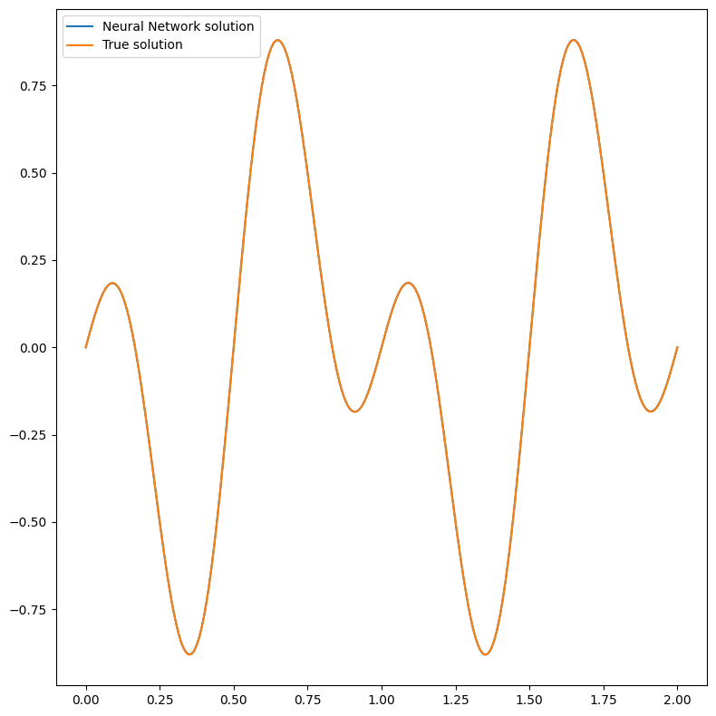
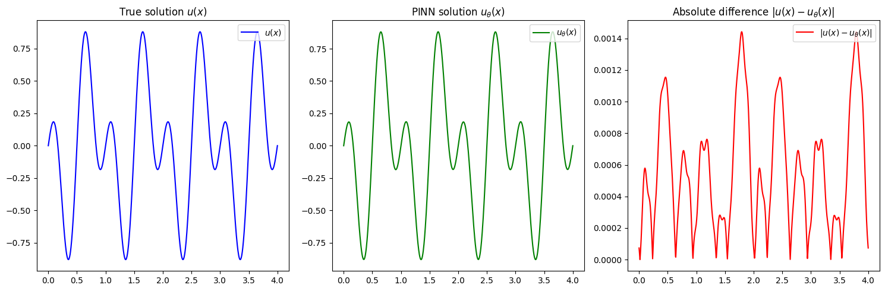

Tutorial: One dimensional Helmotz equation using Periodic Boundary Conditions
=============================================================================

This tutorial presents how to solve with Physics-Informed Neural
Networks (PINNs) a one dimensional Helmotz equation with periodic
boundary conditions (PBC). We will train with standard PINN’s training
by augmenting the input with periodic expasion as presented in `An
expert’s guide to training physics-informed neural
networks <https://arxiv.org/abs/2308.08468>`__.

First of all, some useful imports.

.. code:: ipython3

    import torch
    import matplotlib.pyplot as plt
    
    from pina import Condition, Plotter
    from pina.problem import SpatialProblem
    from pina.operators import laplacian
    from pina.model import FeedForward
    from pina.model.layers import PeriodicBoundaryEmbedding  # The PBC module
    from pina.solvers import PINN
    from pina.trainer import Trainer
    from pina.geometry import CartesianDomain
    from pina.equation import Equation

The problem definition
----------------------

The one-dimensional Helmotz problem is mathematically written as:

.. math::

   \begin{cases}
   \frac{d^2}{dx^2}u(x) - \lambda u(x) -f(x) &=  0 \quad x\in(0,2)\\
   u^{(m)}(x=0) - u^{(m)}(x=2) &= 0 \quad m\in[0, 1, \cdots]\\
   \end{cases}

In this case we are asking the solution to be :math:`C^{\infty}`
periodic with period :math:`2`, on the inifite domain
:math:`x\in(-\infty, \infty)`. Notice that the classical PINN would need
inifinite conditions to evaluate the PBC loss function, one for each
derivative, which is of course infeasable… A possible solution,
diverging from the original PINN formulation, is to use *coordinates
augmentation*. In coordinates augmentation you seek for a coordinates
transformation :math:`v` such that :math:`x\rightarrow v(x)` such that
the periodicity condition $ u^{(m)}(x=0) - u^{(m)}(x=2) = 0
:raw-latex:`\quad `m:raw-latex:`\in[0, 1, \cdots] `$ is satisfied.

For demonstration porpuses the problem specifics are
:math:`\lambda=-10\pi^2`, and
:math:`f(x)=-6\pi^2\sin(3\pi x)\cos(\pi x)` which gives a solution that
can be computed analytically :math:`u(x) = \sin(\pi x)\cos(3\pi x)`.

.. code:: ipython3

    class Helmotz(SpatialProblem):
        output_variables = ['u']
        spatial_domain = CartesianDomain({'x': [0, 2]})
    
        def helmotz_equation(input_, output_):
            x = input_.extract('x')
            u_xx = laplacian(output_, input_, components=['u'], d=['x'])
            f = - 6.*torch.pi**2 * torch.sin(3*torch.pi*x)*torch.cos(torch.pi*x)
            lambda_ = - 10. * torch.pi ** 2
            return u_xx - lambda_ * output_ - f
    
        # here we write the problem conditions
        conditions = {
            'D': Condition(location=spatial_domain,
                           equation=Equation(helmotz_equation)),
        }
    
        def helmotz_sol(self, pts):
            return torch.sin(torch.pi * pts) * torch.cos(3. * torch.pi * pts)
        
        truth_solution = helmotz_sol
    
    problem = Helmotz()
    
    # let's discretise the domain
    problem.discretise_domain(200, 'grid', locations=['D'])

As usual the Helmotz problem is written in **PINA** code as a class. The
equations are written as ``conditions`` that should be satisfied in the
corresponding domains. The ``truth_solution`` is the exact solution
which will be compared with the predicted one. We used latin hypercube
sampling for choosing the collocation points.

Solving the problem with a Periodic Network
-------------------------------------------

Any :math:`\mathcal{C}^{\infty}` periodic function
:math:`u : \mathbb{R} \rightarrow \mathbb{R}` with period
:math:`L\in\mathbb{N}` can be constructed by composition of an arbitrary
smooth function :math:`f : \mathbb{R}^n \rightarrow \mathbb{R}` and a
given smooth periodic function
:math:`v : \mathbb{R} \rightarrow \mathbb{R}^n` with period :math:`L`,
that is :math:`u(x) = f(v(x))`. The formulation is generalizable for
arbitrary dimension, see `A method for representing periodic functions
and enforcing exactly periodic boundary conditions with deep neural
networks <https://arxiv.org/pdf/2007.07442>`__.

In our case, we rewrite
:math:`v(x) = \left[1, \cos\left(\frac{2\pi}{L} x\right), \sin\left(\frac{2\pi}{L} x\right)\right]`,
i.e the coordinates augmentation, and
:math:`f(\cdot) = NN_{\theta}(\cdot)` i.e. a neural network. The
resulting neural network obtained by composing :math:`f` with :math:`v`
gives the PINN approximate solution, that is
:math:`u(x) \approx u_{\theta}(x)=NN_{\theta}(v(x))`.

In **PINA** this translates in using the ``PeriodicBoundaryEmbedding`` layer for
:math:`v`, and any ``pina.model`` for :math:`NN_{\theta}`. Let’s see it
in action!

.. code:: ipython3

    # we encapsulate all modules in a torch.nn.Sequential container
    model = torch.nn.Sequential(PeriodicBoundaryEmbedding(input_dimension=1,
                                             periods=2),
                                FeedForward(input_dimensions=3, # output of PeriodicBoundaryEmbedding = 3 * input_dimension
                                            output_dimensions=1,
                                            layers=[10, 10]))

As simple as that! Notice in higher dimension you can specify different
periods for all dimensions using a dictionary,
e.g. ``periods={'x':2, 'y':3, ...}`` would indicate a periodicity of
:math:`2` in :math:`x`, :math:`3` in :math:`y`, and so on…

We will now sole the problem as usually with the ``PINN`` and
``Trainer`` class.

.. code:: ipython3

    pinn = PINN(problem=problem, model=model)
    trainer = Trainer(pinn, max_epochs=5000, accelerator='cpu', enable_model_summary=False) # we train on CPU and avoid model summary at beginning of training (optional)
    trainer.train()

.. parsed-literal::

    GPU available: True (mps), used: False
    TPU available: False, using: 0 TPU cores
    IPU available: False, using: 0 IPUs
    HPU available: False, using: 0 HPUs

.. parsed-literal::

    `Trainer.fit` stopped: `max_epochs=5000` reached.

.. parsed-literal::

    Epoch 4999: 100%|██████████| 1/1 [00:00<00:00, 155.47it/s, v_num=20, D_loss=0.0123, mean_loss=0.0123]

We are going to plot the solution now!

.. code:: ipython3

    pl = Plotter()
    pl.plot(pinn)

Great, they overlap perfectly! This seeams a good result, considering
the simple neural network used to some this (complex) problem. We will
now test the neural network on the domain :math:`[-4, 4]` without
retraining. In principle the periodicity should be present since the
:math:`v` function ensures the periodicity in :math:`(-\infty, \infty)`.

.. code:: ipython3

    # plotting solution
    with torch.no_grad():
        # Notice here we put [-4, 4]!!!
        new_domain = CartesianDomain({'x' : [0, 4]})
        x = new_domain.sample(1000, mode='grid')
        fig, axes = plt.subplots(1, 3, figsize=(15, 5))
        # Plot 1
        axes[0].plot(x, problem.truth_solution(x), label=r'$u(x)$', color='blue')
        axes[0].set_title(r'True solution $u(x)$')
        axes[0].legend(loc="upper right")
        # Plot 2
        axes[1].plot(x, pinn(x), label=r'$u_{\theta}(x)$', color='green')
        axes[1].set_title(r'PINN solution $u_{\theta}(x)$')
        axes[1].legend(loc="upper right")
        # Plot 3
        diff = torch.abs(problem.truth_solution(x) - pinn(x))
        axes[2].plot(x, diff, label=r'$|u(x) - u_{\theta}(x)|$', color='red')
        axes[2].set_title(r'Absolute difference $|u(x) - u_{\theta}(x)|$')
        axes[2].legend(loc="upper right")
        # Adjust layout
        plt.tight_layout()
        # Show the plots
        plt.show()

It is pretty clear that the network is periodic, with also the error
following a periodic pattern. Obviusly a longer training, and a more
expressive neural network could improve the results!

What’s next?
------------

Nice you have completed the one dimensional Helmotz tutorial of
**PINA**! There are multiple directions you can go now:

1. Train the network for longer or with different layer sizes and assert
   the finaly accuracy

2. Apply the ``PeriodicBoundaryEmbedding`` layer for a time-dependent problem (see
   reference in the documentation)

3. Exploit extrafeature training ?

4. Many more…
