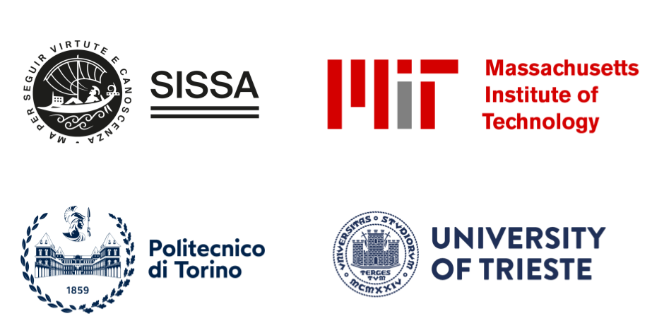

PINA Team
==============

**PINA** is currently developed in the `SISSA MathLab <https://mathlab.sissa.it/>`_, in collaboration with `Fast Computing <https://www.fastcomputing.net/>`_.

A significant part of **PINA** has been written either as a by-product for other projects people were funded for, or by people on university-funded positions.
There are probably many of such projects that have led to some development of **PINA**. We are very grateful for this support!
In particular, we acknowledge the following sources of support with great gratitude:

* `H2020 ERC CoG 2015 AROMA-CFD project 681447 <https://people.sissa.it/~grozza/aroma-cfd/>`_, P.I. Professor `Prof. Gianluigi Rozza <https://mathlab.sissa.it/people/gianluigi-rozza>`_ at `SISSA MathLab <https://mathlab.sissa.it/>`_.
* `Next Generation EU <https://www.agenziacoesione.gov.it/dossier_tematici/nextgenerationeu-e-pnrr/>`_ for ambiental and digital transition for Italy.

We also acknowledge the contribuition of `Maria Strazzullo <https://mstrazzu.github.io/>`_ in the early developments of the package. A special
thank goeas to all the students and researchers from different universities which contributed to the package. 
Finally we warmly thank all the
`contributors <https://contrib.rocks/preview?repo=mathlab%2Fpina>`_ which are the real heart of **PINA**!

