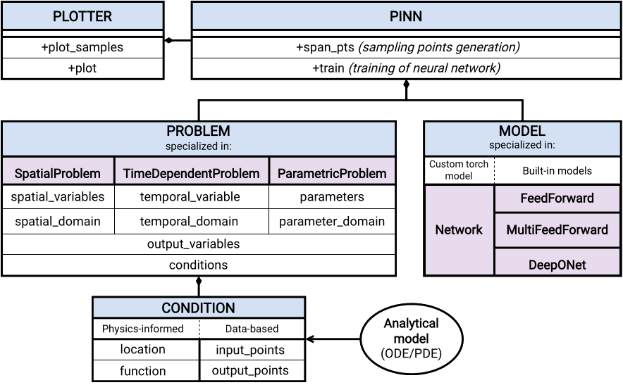

Welcome to PINA's documentation!
===================================================

Physics Informed Neural network for Advanced modeling (**PINA**) is
an open-source Python library providing an intuitive interface for
solving differential equations using PINNs, NOs or both together.
Based on `PyTorch <https://pytorch.org/>`_ and `PyTorchLightning <https://lightning.ai/docs/pytorch/stable/>`_,
PINA offers a simple and intuitive way to formalize a specific (differential) problem
and solve it using neural networks . The approximated solution of a differential equation
can be implemented using PINA in a few lines of code thanks to the intuitive and user-friendly interface.

`PyTorchLightning <https://lightning.ai/docs/pytorch/stable/>`_ as backhand is done to offer
professional AI researchers and machine learning engineers the possibility of using advancement
training strategies provided by the library, such as multiple device training, modern model compression techniques,
gradient accumulation, and so on. In addition, it provides the possibility to add arbitrary
self-contained routines (callbacks) to the training for easy extensions without the need to touch the
underlying code.

The high-level structure of the package is depicted in our API. The pipeline to solve differential equations
with PINA follows just five steps: problem definition, model selection, data generation, solver selection, and training.

.. toctree::
   :maxdepth: 1
   :caption: Package Documentation:
   
   API <_rst/_code>

.. the following is demo content intended to showcase some of the features you can invoke in reStructuredText
.. this can be safely deleted or commented out
.. ........................................................................................

.. toctree::
    :maxdepth: 1
    :caption: Getting Started:

    Installation <_rst/_installation>
    Tutorials <_rst/_tutorial>

.. toctree::
    :maxdepth: 1
    :caption: Community:

    Team & Foundings <_team.rst>
    Contributing <_rst/_contributing>
    License <_LICENSE.rst>
    Cite PINA <_cite.rst>
